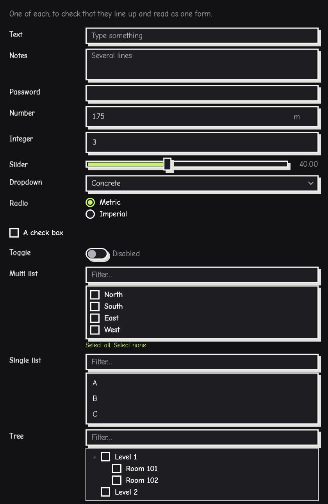
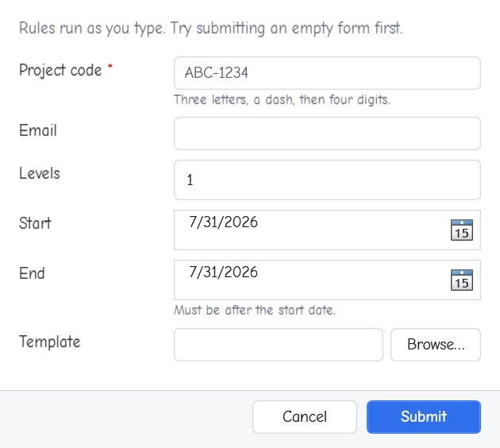
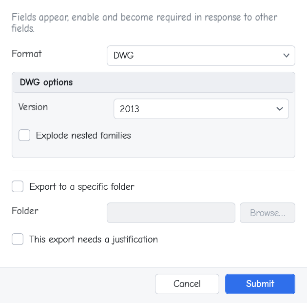
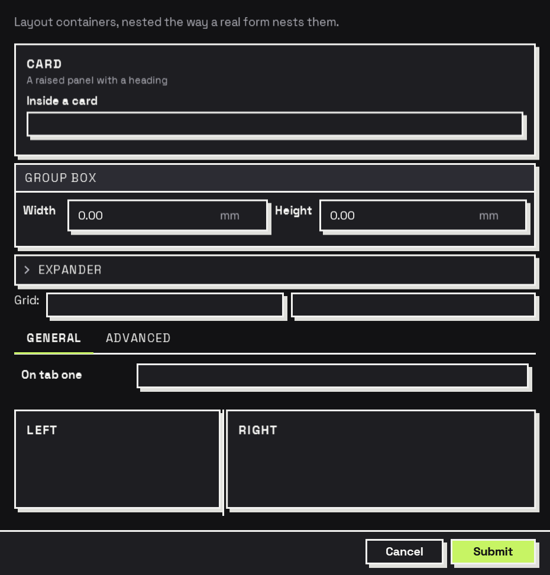
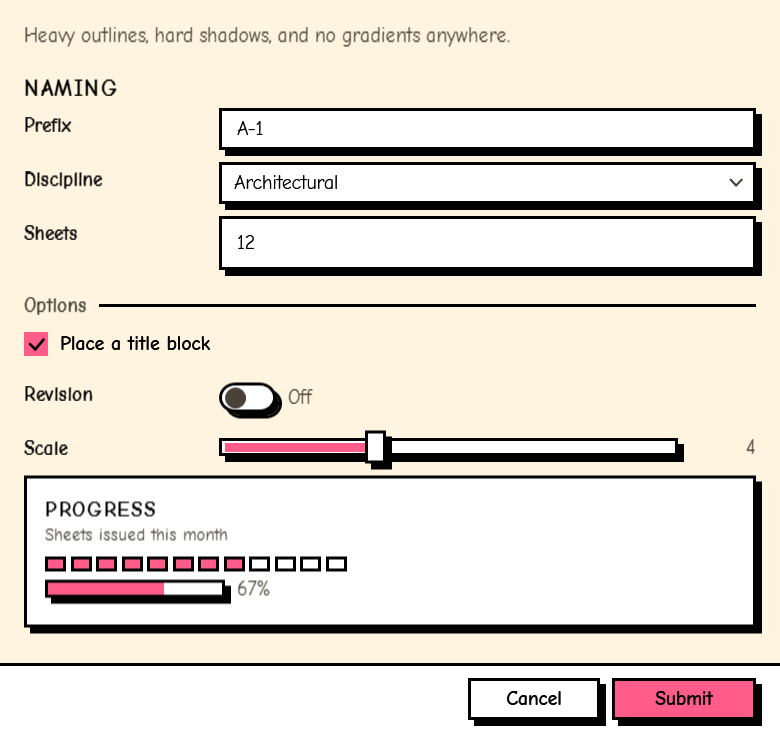
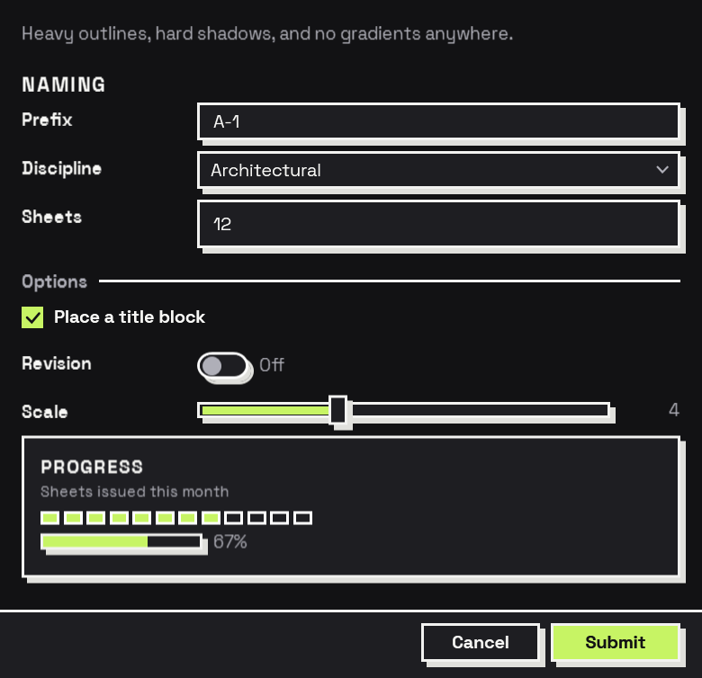
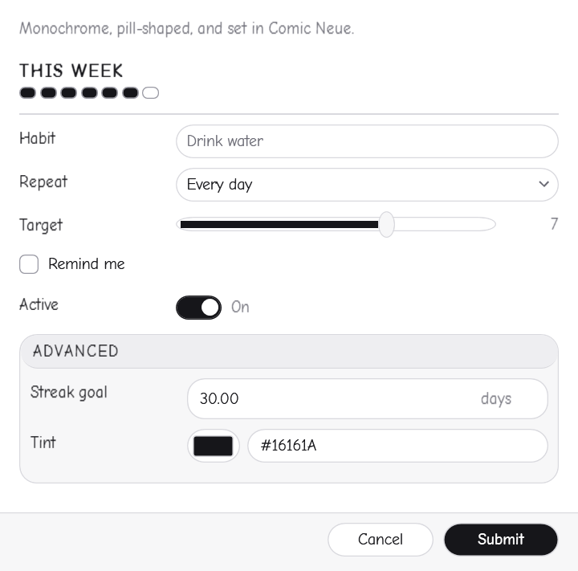
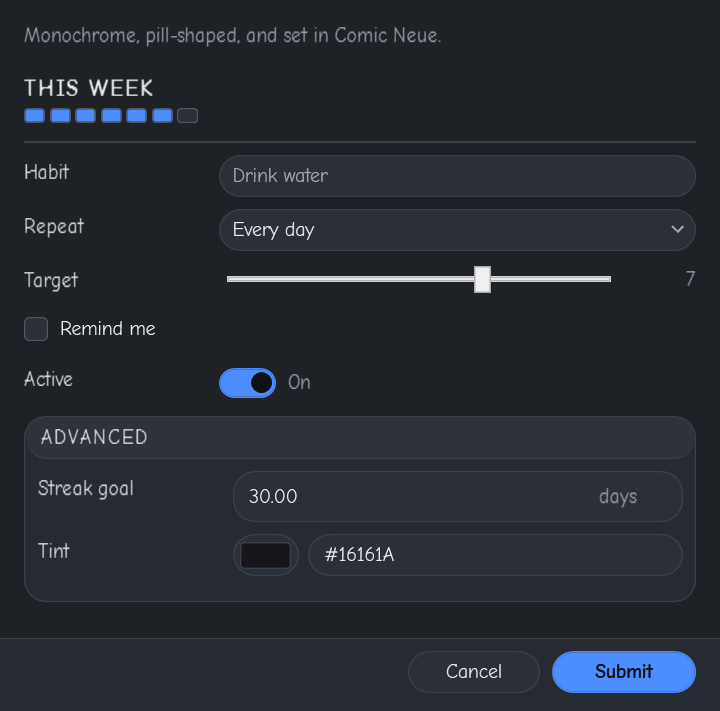

# Interlude

**Declarative forms for Dynamo.** Describe a form with nodes, show it, get typed answers back.

[](https://github.com/johnpierson/Interlude/actions/workflows/build.yml)
[](LICENSE)
[](versions.json)
[](#zero-dependencies)

Interlude is a forms subsystem for Dynamo. A form is a value: nodes build it, a renderer shows
it, and the answers come back in a dictionary you read by name. Conditional visibility, computed
values and live validation are *described*, not wired.

There are no Revit dependencies. Interlude ships one assembly and nothing else.

<p align="center">
  
  &nbsp;
  
</p>

---

## A first form

```
Input.TextBox("Prefix")  ─┐
Input.CheckBox("Include sheets") ─┴─► Form.Show(title: "Rename views")
                                        ├─ values         {prefix: "WIP_", include_sheets: true}
                                        ├─ wasSubmitted   true
                                        ├─ buttonClicked  "submit"
                                        └─ form
```

Read an answer by name:

```
Result.GetString(values, "prefix")   →  "WIP_"
Result.GetBool(values, "include_sheets") →  true
```

Answers are keyed by a slug of the label — `"Wall Type"` becomes `wall_type` — or by an explicit
`key` you give the input. Give real keys to anything you intend to keep: otherwise renaming a
label renames the answer.

## Behaviour without wiring

A field appears when another field says so. Nothing subscribes to anything:

```
Behavior.VisibleIf(
    Input.TextArea("Justification"),
    Condition.IsChecked("needs_justification"))
```

A field is computed from others, and recalculates in dependency order as they change:

```
Behavior.WithComputed(
    Input.Number("Total"),
    Compute.Arithmetic("quantity", "Multiply", "unit_price"))
```

A field is checked while the user types:

```
Behavior.WithValidation(
    Input.TextBox("Project code"),
    Rule.Regex("^[A-Z]{3}-[0-9]{4}$", "Use the form ABC-1234."))
```

Computed values that depend on each other in a loop are rejected when the form is built, before
a window appears — not discovered as a hang.

<p align="center">
  
  &nbsp;
  
</p>

Above: choosing DWG collapses the IFC group away entirely, the unticked check box leaves the
folder field visible but disabled, and the justification field takes up no space at all.

## What it looks like

A form you never themed is **neubrutalist**: heavy black outlines, square corners, solid unblurred
shadows offset down and to the right, loud flat colour, and type set hard. Press a button and it
drops onto its own shadow.

<p align="center">
  
  &nbsp;
  
</p>

A default that looks like nothing in particular is a decision too, and it is the wrong one for a
package whose whole job is the dialog. So the loud option is the one you get for free — and the
quiet one is one node away:

```
Theme.Light() / Theme.Dark("#4C8DFF")   // conventional: hairlines, rounded, no shadows
Theme.Neubrutalism(dark: true)          // the default, explicitly
Theme.System()                          // the default, following the Windows light/dark setting
Theme.Mono()                            // black, white, pills, spaced capitals
Theme.Create(borderWidth: 3, shadowOffset: 6, shape: "Square", heavyText: true)
```

The default stays **light** rather than following Windows. This palette is built around cream and
black; flipping to the inverted one because the machine happens to be set to dark is a different
design, not the same one dimmed. `Theme.System()` is the version that follows.

<p align="center">
  
  &nbsp;
  
</p>

Interlude styles only the controls it draws, in the form window's own resource dictionary. It
never writes to the host application's resources, so nothing it does can restyle Revit or Dynamo.
Sliders, date fields and progress bars are drawn by Interlude rather than left to Windows, because
one stock hairline control among a page of heavy outlines is what makes a themed form look
half-finished.

Interlude sets its own font — **Space Grotesk**, embedded in the assembly rather than named, so a
form looks the same on every machine instead of depending on what happens to be installed. It is
the grotesque this style is usually set in: geometric, slightly odd, and heavy enough at Bold to
hold its own beside a three-pixel outline. Name any other on `Theme.Create`'s `fontFamily` port.

## Cancelling returns defaults, not nulls

This is the deliberate break with what came before. A cancelled form returns **every field's
default value**, with `wasSubmitted` false:

```
values         {prefix: "WIP_", include_sheets: false}   // the defaults
wasSubmitted   false
```

Check `wasSubmitted` before acting. You never have to null-check the answers, and a cancelled
form cannot produce a failure three nodes downstream that has nothing to do with cancelling.

## Re-execution

Dynamo re-runs a graph whenever anything upstream changes, and a node that shows a dialog shows
it again. Interlude does not pretend otherwise; it gives you the controls:

- **`trigger`** — set it to `false` to skip the dialog and return the last answers. Gate a form
  behind a boolean or a button.
- **Re-entrancy latch** — a form already on screen is never opened twice. A second execution
  waits for the first window and returns its answer.
- **Remembered values** — a form re-opens with the answers it was last submitted with.
  Cancelling never overwrites them.
- **Manual run mode** is still the right setting for a graph built around a form.

## Installing

Download the archive for your Dynamo version from
[Releases](https://github.com/johnpierson/Interlude/releases) and unzip it into your Dynamo
packages folder. See [docs/installing.md](docs/installing.md).

| Archive | Dynamo | Revit |
| --- | --- | --- |
| `dynamo3.0` | 3.0 | 2025 |
| `dynamo3.6` | 3.6 | 2026 |
| `dynamo4.0` | 4.0 | 2027 |

Older Revit versions are out of scope: Interlude is .NET 8 and later, matching Dynamo 3.0+.

Confirmed running in Revit 2027, Dynamo Player and Dynamo Sandbox 4.1 and 4.2. Every build is
checked against Dynamo's real importer on every change.
[docs/installing.md](docs/installing.md#where-it-has-been-run) records what has been run where, and
what has not.

## The node library

Everything lives under a single **Interlude** category.

| Group | What it does |
| --- | --- |
| **Input** | The 17 fields a user answers: text, numbers, sliders, dropdowns, lists, trees, dates, colours, files, folders. |
| **Layout** | Sections, rows, columns, grids, tabs, cards, splitters, and the elements that show rather than ask. |
| **Behavior** | `VisibleIf`, `EnabledIf`, `RequiredIf`, `Required`, `WithValidation`, `WithComputed`. Each returns a *new* element. |
| **Condition** | Tests over the form's own answers, for the Behavior nodes. |
| **Compute** | Values worked out from other answers. |
| **Rule** | Checks applied while the user types. |
| **Theme** | `Neubrutalism` (the default), `Mono`, `Light`, `Dark`, accent, density, fonts, outlines, shadows. |
| **Form** | `Show`, `Create`, `Check`, `ToJson`, `FromJson`, `Options`, `Forget`. |
| **Result** | Typed accessors: `GetString`, `GetNumber`, `GetBool`, `GetDate`, `GetColor`, `GetFilePaths`. |

**[Node reference](docs/node-reference.md)** documents every node and every port. Every node also
ships its own help page inside the package, so selecting a node in Dynamo and opening **Help**
shows it in the panel beside the graph — generated from the assembly, so it cannot drift
([docs/nodes](docs/nodes/)).
**[Recipes](docs/recipes.md)** works through the patterns that come up in real forms — gating a
dialog, offering several outcomes, wizards, live totals, unattended runs.

## Forms are documents

`Form.ToJson` and `Form.FromJson` round-trip a form losslessly. A form can be checked into a
repository, reviewed in a pull request, diffed between releases, and loaded by a graph that did
not build it. [`samples/`](samples/) holds worked examples; the test suite validates each of
them against the schema on every build.

The theme travels with the form, but a built-in palette travels as its *name* — `"preset":
"neubrutalist"` — rather than as eighteen colours in two modes. A form checked into a repository
should not show a palette diff every time the built-in colours are tuned.

```json
{
  "schemaVersion": 1,
  "title": "Rename views",
  "elements": [
    { "$type": "textBox", "key": "prefix", "label": "Prefix", "placeholder": "e.g. WIP_" },
    { "$type": "checkBox", "key": "include_sheets", "content": "Include sheets" }
  ]
}
```

## Zero dependencies

Interlude ships exactly **one** file: `Interlude.dll`, plus its XML documentation and the Dynamo
customization file. Nothing else.

That is a deliberate constraint, not an achievement. A Dynamo package is unzipped into a flat
folder that Revit shares with every other add-in in the process. Every additional DLL is a
version conflict waiting for the user who installs one more package — and it is *their* Revit
that stops working, not ours. So Interlude uses the BCL, in-box WPF and in-box `System.Text.Json`
and nothing more. The build fails if a second assembly appears in the output, and CI checks the
packaged folders again afterwards.

## Coming from Data-Shapes

[docs/migrating-from-data-shapes.md](docs/migrating-from-data-shapes.md) maps the nodes across and
is explicit about the behavioural differences — the cancellation contract above being the one to
read first.

## Building

Requires the .NET 10 SDK, which compiles every target in the matrix.

```bash
dotnet build Interlude.sln
dotnet test Interlude.sln
```

```powershell
./scripts/build-all.ps1 -Pack   # all three Dynamo versions, laid out as packages under dist/
```

The **preview harness** (`tools/Interlude.Preview`) shows the sample gallery in either theme and
hot-reloads a form from a JSON file — which turns "edit the form, rebuild, restart Revit" into
"edit the file".

```bash
dotnet run --project tools/Interlude.Preview
```

## Documentation

| | |
| --- | --- |
| [Installing](docs/installing.md) | Which download, where it goes, what to do when it does not appear |
| [Node reference](docs/node-reference.md) | Every node and every port |
| [Node help](docs/nodes/) | The per-node pages Dynamo shows in its help panel, generated from the assembly |
| [Recipes](docs/recipes.md) | Worked patterns for real forms |
| [Coming from Data-Shapes](docs/migrating-from-data-shapes.md) | Node mapping and behavioural differences |
| [Forms as JSON](docs/form-json.md) | The schema, and what survives a round trip |
| [Architecture](docs/architecture.md) | Layering, the reactive session, threading, and the reasoning |
| [Contributing](CONTRIBUTING.md) | Setting up, the rules with teeth, adding a control |

[docs/architecture.md](docs/architecture.md) is the one to read before changing anything
structural — including why WPF, why one assembly, and why the evaluator re-runs everything on
every edit.

## Licence

MIT. See [LICENSE](LICENSE).

Interlude owes an obvious debt to [Data-Shapes](https://github.com/MrMoMoNaRCH/Data-Shapes_Dynamo),
which established that a Dynamo graph could ask a question properly. This is a different answer to
the same problem, not a criticism of that one.
