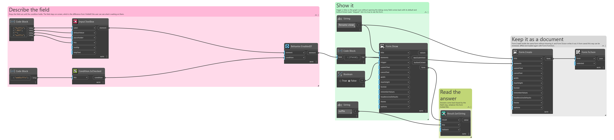
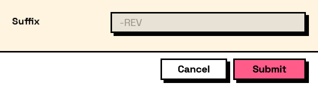

## In Depth

`Behavior.EnabledIf(element, condition)`

Enables the element only while the condition holds. A disabled element is still visible, greyed out, and still contributes its value.

The inputs are:

- `element` (_FormElement_) — The element to control.
- `condition` (_ConditionExpr_) — Built with the Condition nodes.

Returns `element` — A copy of the element with the condition attached.

Search terms: `enabled`, `disabled`, `greyed`, `conditional`, `enabledif`.

___
## About the Behavior nodes

Adds behaviour to an element: when it is visible, when it is enabled, when it is required, what makes it valid, and what its value is computed from.

Every node here returns a new element rather than changing the one it was given. Elements are values, so the same element can be fed into two different behaviours without one of them affecting the other, and re-running a graph rebuilds the tree from scratch with nothing left over from last time.

___
## Example File

An example graph ships beside this page as `Interlude.Behavior.EnabledIf.dyn`.

The form it builds:

