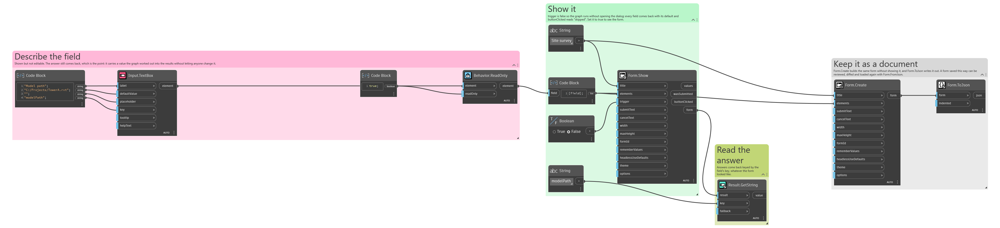
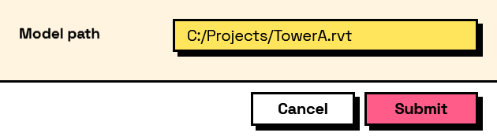

## In Depth

`Behavior.ReadOnly(element, readOnly: true)`

Makes an input read-only. It stays visible and still contributes its value.

For showing a figure the user should see but not change — a value read from the model, an identifier the graph generated.

The difference from `Behavior.EnabledIf` with a false condition is what it says: a disabled field looks broken or not-yet-applicable, while a read-only one looks settled. Both still contribute their value to the answers.

`Behavior.WithComputed` already makes a field read-only, so there is no need for both.

The inputs are:

- `element` (_FormElement_) — The input to lock.
- `readOnly` (_boolean_, defaults to `true`) — Whether the field is locked.

Returns `element` — A copy of the element.

Search terms: `readonly`, `locked`, `disabled`, `display`.

___
## About the Behavior nodes

Adds behaviour to an element: when it is visible, when it is enabled, when it is required, what makes it valid, and what its value is computed from.

Every node here returns a new element rather than changing the one it was given. Elements are values, so the same element can be fed into two different behaviours without one of them affecting the other, and re-running a graph rebuilds the tree from scratch with nothing left over from last time.

___
## Example File

An example graph ships beside this page as `Interlude.Behavior.ReadOnly.dyn`.

The form it builds:

