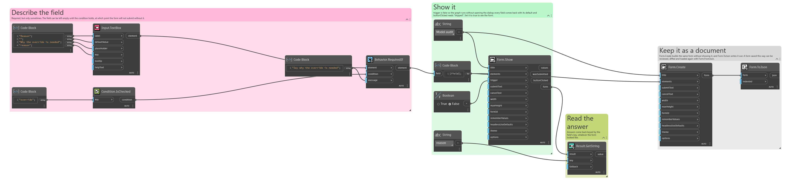
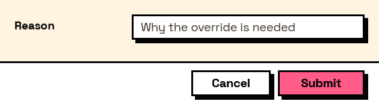

## In Depth

`Behavior.RequiredIf(element, condition, message: "")`

Makes the element required only while the condition holds.

For the field that matters in one case and not in another: a justification demanded only when an override was ticked, a folder demanded only when exporting was chosen.

The asterisk beside the label appears and disappears with the condition, so the user is never asked for something the form has not yet told them it wants. And a field that is required but hidden is not enforced — hidden always wins, so the form can never be blocked by a control nobody can see.

The inputs are:

- `element` (_FormElement_) — The element to control.
- `condition` (_ConditionExpr_) — Built with the Condition nodes.
- `message` (_string_, defaults to `""`) — Wording shown when the field is left empty.

Returns `element` — A copy of the element with the condition attached.

Search terms: `required`, `mandatory`, `conditional`, `requiredif`.

___
## About the Behavior nodes

Adds behaviour to an element: when it is visible, when it is enabled, when it is required, what makes it valid, and what its value is computed from.

Every node here returns a new element rather than changing the one it was given. Elements are values, so the same element can be fed into two different behaviours without one of them affecting the other, and re-running a graph rebuilds the tree from scratch with nothing left over from last time.

___
## Example File

An example graph ships beside this page as `Interlude.Behavior.RequiredIf.dyn`.

The form it builds:

