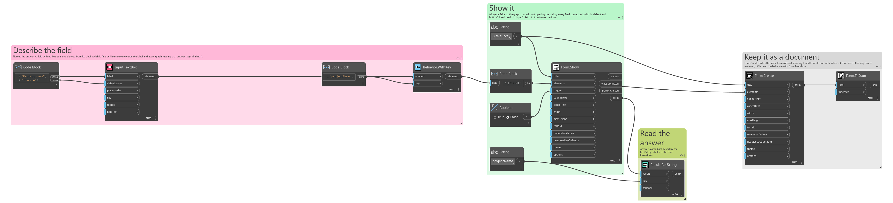
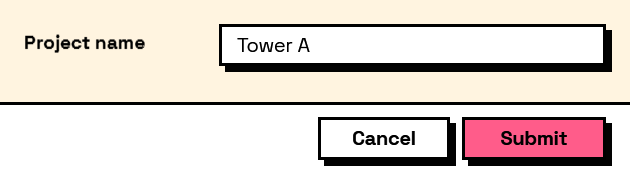

## In Depth

`Behavior.WithKey(element, key)`

Sets the name this element's answer appears under in the results, overriding the one derived from its label. Worth doing for any graph you intend to keep.

The inputs are:

- `element` (_FormElement_) — The element to name.
- `key` (_string_) — The result key.

Returns `element` — A copy of the element with the key set.

Search terms: `key`, `name`, `rename`, `identifier`.

___
## About the Behavior nodes

Adds behaviour to an element: when it is visible, when it is enabled, when it is required, what makes it valid, and what its value is computed from.

Every node here returns a new element rather than changing the one it was given. Elements are values, so the same element can be fed into two different behaviours without one of them affecting the other, and re-running a graph rebuilds the tree from scratch with nothing left over from last time.

___
## Example File

An example graph ships beside this page as `Interlude.Behavior.WithKey.dyn`.

The form it builds:

