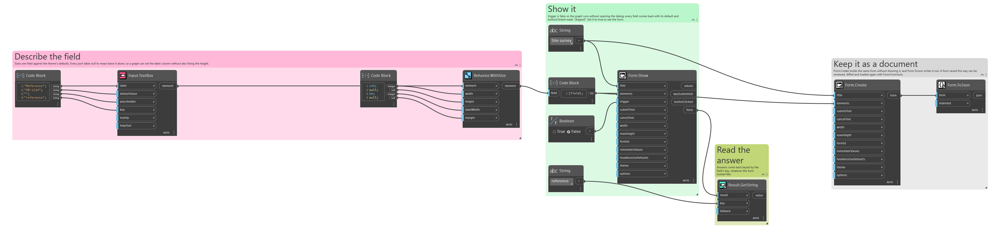
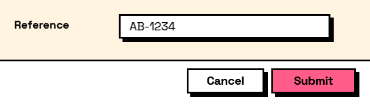

## In Depth

`Behavior.WithSize(element, width: null, height: null, labelWidth: null, margin: null)`

Overrides an element's size and spacing. Everything left null stays as the theme decided.

A last resort, and deliberately so. Sizing is the theme's job — set it once with `Theme.Create` and every form in the office agrees — and a form pinned together with per-element overrides has to be re-tuned by hand whenever the theme, the density or the font changes underneath it.

Where it is genuinely right: one field that has to be wider than the rest because of what goes in it, such as a full file path in a column sized for names.

The inputs are:

- `element` (_FormElement_) — The element to size.
- `width` (_object_, defaults to `null`) — Fixed width in pixels.
- `height` (_object_, defaults to `null`) — Fixed height in pixels.
- `labelWidth` (_object_, defaults to `null`) — Width of this element's label column. Zero stacks the label above.
- `margin` (_object_, defaults to `null`) — Space around the element in pixels.

Returns `element` — A copy of the element with the sizing applied.

Search terms: `style`, `width`, `height`, `size`, `margin`, `spacing`.

___
## About the Behavior nodes

Adds behaviour to an element: when it is visible, when it is enabled, when it is required, what makes it valid, and what its value is computed from.

Every node here returns a new element rather than changing the one it was given. Elements are values, so the same element can be fed into two different behaviours without one of them affecting the other, and re-running a graph rebuilds the tree from scratch with nothing left over from last time.

___
## Example File

An example graph ships beside this page as `Interlude.Behavior.WithSize.dyn`.

The form it builds:

