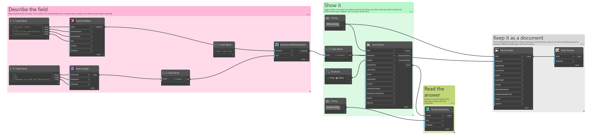
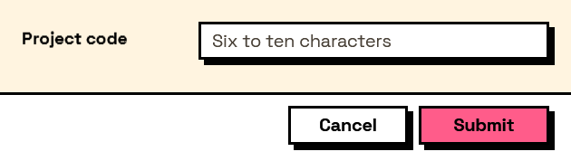

## In Depth

`Behavior.WithValidation(element, rule)`

Adds a validation rule, built with the Rule nodes. Rules are checked as the user types, and the first one to fail is the message they see.

The inputs are:

- `element` (_FormElement_) — The element to check.
- `rule` (_list of object_) — One rule, or a list of them.

Returns `element` — A copy of the element with the rules attached.

Search terms: `validation`, `rule`, `check`, `validate`, `constraint`.

___
## About the Behavior nodes

Adds behaviour to an element: when it is visible, when it is enabled, when it is required, what makes it valid, and what its value is computed from.

Every node here returns a new element rather than changing the one it was given. Elements are values, so the same element can be fed into two different behaviours without one of them affecting the other, and re-running a graph rebuilds the tree from scratch with nothing left over from last time.

___
## Example File

An example graph ships beside this page as `Interlude.Behavior.WithValidation.dyn`.

The form it builds:

