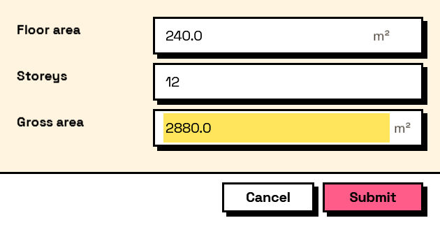

## In Depth

`Compute.Arithmetic(left, operation, right)`

Arithmetic on two values. Each side is either a field key or a nested computation. Dividing by zero gives zero rather than infinity, so a half-filled form shows a sensible total instead of a symbol.

The inputs are:

- `left` (_object_) — A field key, a literal, or a nested computation.
- `operation` (_string_) — Add, Subtract, Multiply, Divide, Modulo, Power, Min or Max.
- `right` (_object_) — A field key, a literal, or a nested computation.

Returns `computation` — The computation.

Search terms: `arithmetic`, `math`, `multiply`, `divide`, `subtract`, `calculate`.

___
## About the Compute nodes

Values worked out from other answers, for use with `Behavior.WithComputed`.

A computed field is driven by the form rather than by the user: it recalculates whenever anything it reads changes, in dependency order, so a total built on a subtotal is always consistent. Computed values that depend on each other in a loop are rejected when the form is built, before a window appears.

___
## Example File

An example graph ships beside this page as `Interlude.Compute.Arithmetic.dyn`.

The form it builds:

