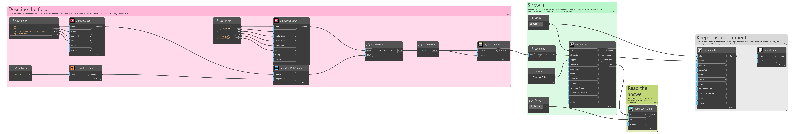
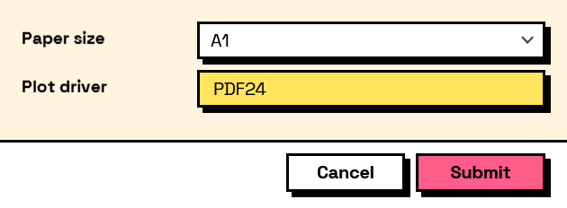

## In Depth

`Compute.Constant(value: null)`

A fixed value that never changes.

Not useful on its own — a computed field holding a constant is a label with extra steps. It exists to be fed into the nodes that take computations on both sides: the number to multiply by in `Compute.Arithmetic`, or either branch of `Compute.If`.

The inputs are:

- `value` (_object_, defaults to `null`) — The value.

Returns `computation` — The computation.

Search terms: `constant`, `literal`, `fixed`, `value`.

___
## About the Compute nodes

Values worked out from other answers, for use with `Behavior.WithComputed`.

A computed field is driven by the form rather than by the user: it recalculates whenever anything it reads changes, in dependency order, so a total built on a subtotal is always consistent. Computed values that depend on each other in a loop are rejected when the form is built, before a window appears.

___
## Example File

An example graph ships beside this page as `Interlude.Compute.Constant.dyn`.

The form it builds:

