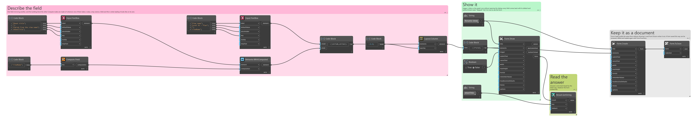
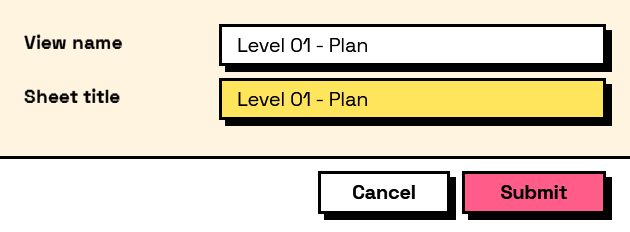

## In Depth

`Compute.Field(key)`

The current value of another field, passed through unchanged.

The counterpart to `Compute.Constant`: where that supplies a fixed number to a calculation, this supplies a live one. Together they are how the two sides of `Compute.Arithmetic` and the branches of `Compute.If` get filled in.

On its own it mirrors one field into another, which is worth doing when the same answer needs to be visible in two places on a long form.

The inputs are:

- `key` (_string_) — The field to read.

Returns `computation` — The computation.

Search terms: `field`, `value`, `reference`, `copy`, `mirror`.

___
## About the Compute nodes

Values worked out from other answers, for use with `Behavior.WithComputed`.

A computed field is driven by the form rather than by the user: it recalculates whenever anything it reads changes, in dependency order, so a total built on a subtotal is always consistent. Computed values that depend on each other in a loop are rejected when the form is built, before a window appears.

___
## Example File

An example graph ships beside this page as `Interlude.Compute.Field.dyn`.

The form it builds:

