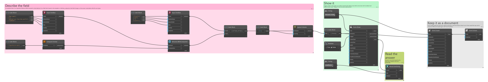
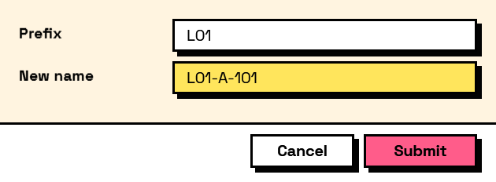

## In Depth

`Compute.Format(template)`

Fills field values into a template: `"Hello {firstName} {lastName}"`. Write a literal brace by doubling it.

A placeholder may carry a .NET format specifier after a colon, which is usually what stands between a template and something worth showing someone: `{sequence:000}` pads to three digits, `{total:F2}` fixes two decimals, `{due:yyyy-MM-dd}` writes a date the way a file name wants it. Without one, numbers print the shortest form that round-trips, so a total of 546.0 reads "546" and 0.1 + 0.2 reads "0.30000000000000004".

To show the result on the form rather than store it, `Layout.Preview` takes a template directly and needs neither this node nor a field to put the answer in.

The inputs are:

- `template` (_string_) — The text, with field keys in braces.

Returns `computation` — The computation.

Search terms: `format`, `template`, `interpolate`, `text`, `concat`, `string`.

___
## About the Compute nodes

Values worked out from other answers, for use with `Behavior.WithComputed`.

A computed field is driven by the form rather than by the user: it recalculates whenever anything it reads changes, in dependency order, so a total built on a subtotal is always consistent. Computed values that depend on each other in a loop are rejected when the form is built, before a window appears.

___
## Example File

An example graph ships beside this page as `Interlude.Compute.Format.dyn`.

The form it builds:

