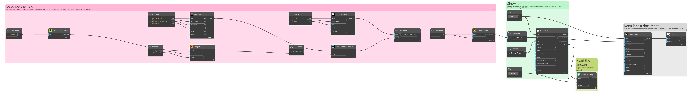
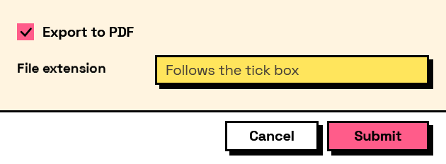

## In Depth

`Compute.If(condition, ifTrue: null, ifFalse: null)`

Chooses between two values based on a condition.

How a computed field changes its mind: a rate that depends on which discipline was picked, a total that switches between metric and imperial. The condition is a Condition node, so it reads the form's own answers, and the whole thing recalculates whenever any field it touches changes.

Both branches are computations, so either can be a nested `Compute.If` — which is how a three-way choice is written, if not especially readably. Past two levels, a lookup table with `Compute.Lookup` is easier to follow and easier to change.

The inputs are:

- `condition` (_ConditionExpr_) — Built with the Condition nodes.
- `ifTrue` (_object_, defaults to `null`) — A field key, a literal, or a nested computation.
- `ifFalse` (_object_, defaults to `null`) — A field key, a literal, or a nested computation.

Returns `computation` — The computation.

Search terms: `if`, `conditional`, `ternary`, `choose`, `when`.

___
## About the Compute nodes

Values worked out from other answers, for use with `Behavior.WithComputed`.

A computed field is driven by the form rather than by the user: it recalculates whenever anything it reads changes, in dependency order, so a total built on a subtotal is always consistent. Computed values that depend on each other in a loop are rejected when the form is built, before a window appears.

___
## Example File

An example graph ships beside this page as `Interlude.Compute.If.dyn`.

The form it builds:

