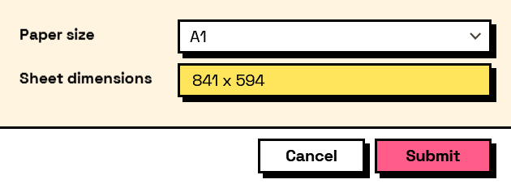

## In Depth

`Compute.Lookup(key, lookupKeys, lookupValues, fallback: null)`

Maps a field's answer through a lookup table. The keys are matched against the answer's text form.

The inputs are:

- `key` (_string_) — The field to read.
- `lookupKeys` (_list of object_) — The values to match.
- `lookupValues` (_list of object_) — What each match produces.
- `fallback` (_object_, defaults to `null`) — What to produce when nothing matches.

Returns `computation` — The computation.

Search terms: `lookup`, `map`, `translate`, `dictionary`, `switch`.

___
## About the Compute nodes

Values worked out from other answers, for use with `Behavior.WithComputed`.

A computed field is driven by the form rather than by the user: it recalculates whenever anything it reads changes, in dependency order, so a total built on a subtotal is always consistent. Computed values that depend on each other in a loop are rejected when the form is built, before a window appears.

___
## Example File

An example graph ships beside this page as `Interlude.Compute.Lookup.dyn`.

The form it builds:

