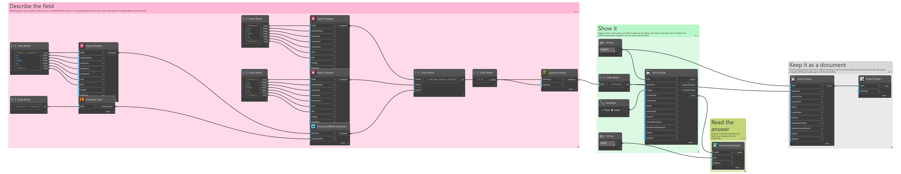
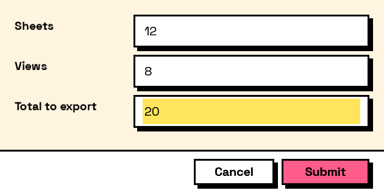

## In Depth

`Compute.Sum(keys)`

Adds up several fields. Anything that is not a number counts as zero, and a multi-select of numbers adds up its own items.

The inputs are:

- `keys` (_list of object_) — The fields to add.

Returns `computation` — The computation.

Search terms: `sum`, `total`, `add`, `plus`.

___
## About the Compute nodes

Values worked out from other answers, for use with `Behavior.WithComputed`.

A computed field is driven by the form rather than by the user: it recalculates whenever anything it reads changes, in dependency order, so a total built on a subtotal is always consistent. Computed values that depend on each other in a loop are rejected when the form is built, before a window appears.

___
## Example File

An example graph ships beside this page as `Interlude.Compute.Sum.dyn`.

The form it builds:

