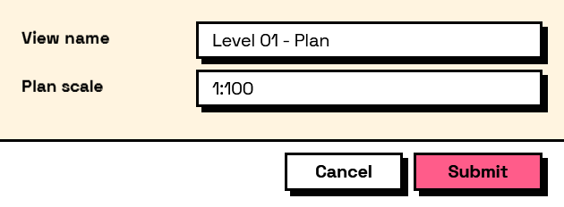

## In Depth

`Condition.Contains(key, value, ignoreCase: false)`

True when the field contains the value: as a substring for text, or as a member for a multi-select answer.

The inputs are:

- `key` (_string_) — The field to read.
- `value` (_object_) — What to look for.
- `ignoreCase` (_boolean_, defaults to `false`) — Ignore letter case when comparing text.

Returns `condition` — The condition.

Search terms: `contains`, `includes`, `has`, `substring`.

___
## About the Condition nodes

Tests over a form's own answers, for use with the Behavior nodes.

Conditions name the field they read by its key — the same key the answer appears under in the results. They are re-evaluated whenever that field changes, so a form's behaviour is described once, declaratively, rather than wired up event by event.

Comparisons are type-aware: numbers compare numerically even when typed as text, lists compare element by element, and text comparison is case-sensitive unless `ignoreCase` says otherwise.

___
## Example File

An example graph ships beside this page as `Interlude.Condition.Contains.dyn`.

The form it builds:

