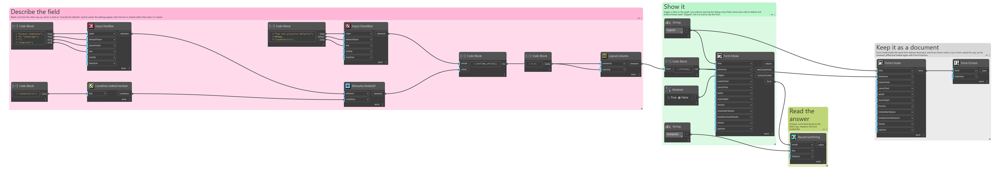
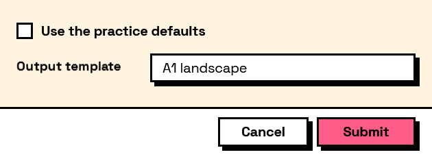

## In Depth

`Condition.IsNotChecked(key)`

True when a tick box or switch is off.

The inputs are:

- `key` (_string_) — The field to read.

Returns `condition` — The condition.

Search terms: `unchecked`, `unticked`, `off`, `false`.

___
## About the Condition nodes

Tests over a form's own answers, for use with the Behavior nodes.

Conditions name the field they read by its key — the same key the answer appears under in the results. They are re-evaluated whenever that field changes, so a form's behaviour is described once, declaratively, rather than wired up event by event.

Comparisons are type-aware: numbers compare numerically even when typed as text, lists compare element by element, and text comparison is case-sensitive unless `ignoreCase` says otherwise.

___
## Example File

An example graph ships beside this page as `Interlude.Condition.IsNotChecked.dyn`.

The form it builds:

