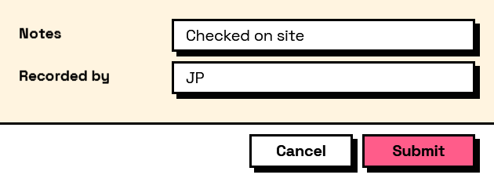

## In Depth

`Condition.IsNotEmpty(key)`

True when the field has an answer.

The usual way to reveal the next step of a form once the previous one is filled in: show the options only after a file has been chosen.

Note what counts. False and zero are answers, so an unticked box and a numeric field reading 0 are both "not empty". Only blank text and nothing-selected are empty.

The inputs are:

- `key` (_string_) — The field to read.

Returns `condition` — The condition.

Search terms: `not empty`, `answered`, `filled`, `has value`.

___
## About the Condition nodes

Tests over a form's own answers, for use with the Behavior nodes.

Conditions name the field they read by its key — the same key the answer appears under in the results. They are re-evaluated whenever that field changes, so a form's behaviour is described once, declaratively, rather than wired up event by event.

Comparisons are type-aware: numbers compare numerically even when typed as text, lists compare element by element, and text comparison is case-sensitive unless `ignoreCase` says otherwise.

___
## Example File

An example graph ships beside this page as `Interlude.Condition.IsNotEmpty.dyn`.

The form it builds:

