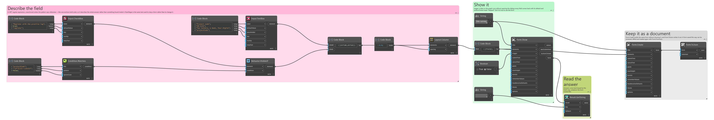
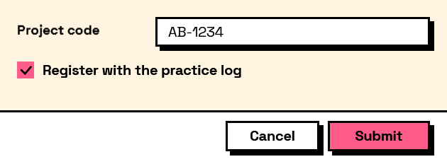

## In Depth

`Condition.Matches(key, pattern, ignoreCase: false)`

True when the field's answer matches a regular expression.

For steering a form on the *shape* of an answer rather than its exact value — revealing the sheet-number options only once the prefix looks like a real prefix.

Unanchored patterns match anywhere in the text; add `^` and `$` when the whole answer has to match. This is the Condition-side twin of `Rule.Regex`: use that one to stop a form being submitted, this one to change what the form shows.

The inputs are:

- `key` (_string_) — The field to read.
- `pattern` (_string_) — A .NET regular expression.
- `ignoreCase` (_boolean_, defaults to `false`) — Ignore letter case when matching.

Returns `condition` — The condition.

Search terms: `matches`, `regex`, `pattern`, `expression`.

___
## About the Condition nodes

Tests over a form's own answers, for use with the Behavior nodes.

Conditions name the field they read by its key — the same key the answer appears under in the results. They are re-evaluated whenever that field changes, so a form's behaviour is described once, declaratively, rather than wired up event by event.

Comparisons are type-aware: numbers compare numerically even when typed as text, lists compare element by element, and text comparison is case-sensitive unless `ignoreCase` says otherwise.

___
## Example File

An example graph ships beside this page as `Interlude.Condition.Matches.dyn`.

The form it builds:

