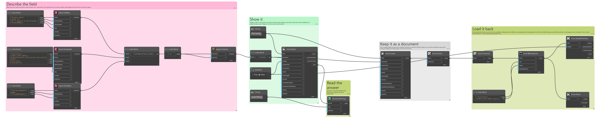
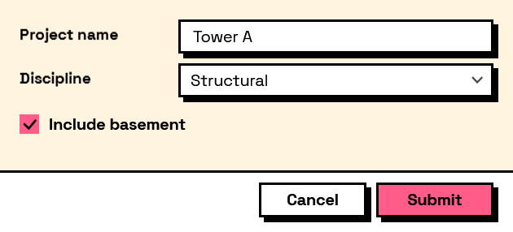

## In Depth

`Form.Check(form)`

Reports the problems Interlude can see in a form without showing it: conditions that name a field that does not exist, duplicate keys, and computed values that depend on each other in a loop.

The inputs are:

- `form` (_FormDefinition_) — The form to check.

The outputs are:

- `isValid` — True when nothing was found.
- `messages` — What was found, if anything.

Search terms: `validate`, `check`, `lint`, `problems`, `warnings`, `debug`.

___
## About the Form nodes

Showing a form and getting the answers back.

A note on re-execution, because it surprises everyone once: Dynamo re-runs a graph whenever anything upstream changes, and a node that shows a dialog will show it again. Interlude does not pretend otherwise — it gives you the tools to control it. The `trigger` port skips the dialog and returns the last answers when it is false, so a form can be gated behind a button or a boolean. A form already on screen is never opened twice: a second execution waits for the first window and returns its result rather than stacking dialogs. And Manual run mode remains the right setting for any graph built around a form.

___
## Example File

An example graph ships beside this page as `Interlude.Form.Check.dyn`.

The form it builds:

