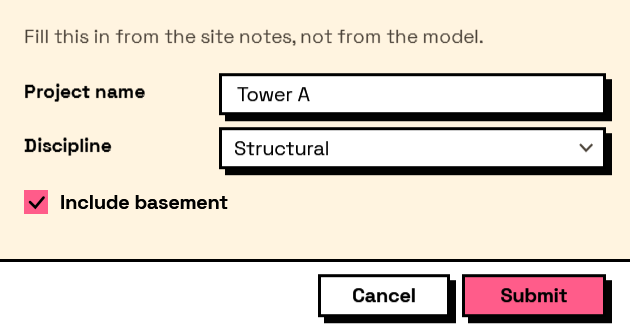

## In Depth

`Form.Options(description: "", height: null, resizable: true, showCancel: true, closeOnEscape: true, extraButtons: null, iconPath: "")`

The less common form settings, for `Form.Show`'s options port.

`Form.Show` already carries the settings most forms need. This holds the rest, so that the node everyone uses does not have thirty ports on it — window behaviour, extra buttons, and whether a cancel button appears at all.

The inputs are:

- `description` (_string_, defaults to `""`) — A paragraph shown above the first field.
- `height` (_object_, defaults to `null`) — Fixed window height. Null sizes the window to its contents.
- `resizable` (_boolean_, defaults to `true`) — Let the user resize the window.
- `showCancel` (_boolean_, defaults to `true`) — Show the cancel button.
- `closeOnEscape` (_boolean_, defaults to `true`) — Let Escape cancel the form.
- `extraButtons` (_list of object_, defaults to `null`) — Extra footer buttons, built with Layout.Button.
- `iconPath` (_string_, defaults to `""`) — Path to a window icon.

Returns `options` — The options.

Search terms: `options`, `settings`, `description`, `height`, `resizable`, `buttons`.

___
## About the Form nodes

Showing a form and getting the answers back.

A note on re-execution, because it surprises everyone once: Dynamo re-runs a graph whenever anything upstream changes, and a node that shows a dialog will show it again. Interlude does not pretend otherwise — it gives you the tools to control it. The `trigger` port skips the dialog and returns the last answers when it is false, so a form can be gated behind a button or a boolean. A form already on screen is never opened twice: a second execution waits for the first window and returns its result rather than stacking dialogs. And Manual run mode remains the right setting for any graph built around a form.

___
## Example File

An example graph ships beside this page as `Interlude.Form.Options.dyn`.

The form it builds:

