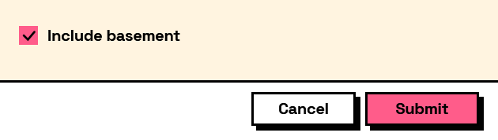

## In Depth

`Input.CheckBox(label, defaultValue: false, key: "", tooltip: "", helpText: "")`

A tick box. The answer is true or false, and never null.

Note where the wording goes: a tick box has no separate label column. What you pass as `label` is printed beside the box, and the answer key is derived from that wording. Phrase it as the thing being turned on — "Include sheets", not "Sheets" — because the user reads it as a statement they are agreeing to.

This is what `Condition.IsChecked` tests, which makes it the usual way to reveal part of a form: tick a box, and a group appears.

The inputs are:

- `label` (_string_) — Text shown beside the box.
- `defaultValue` (_boolean_, defaults to `false`) — Whether the box starts ticked.
- `key` (_string_, defaults to `""`) — Name of this answer in the results. Derived from the label when empty.
- `tooltip` (_string_, defaults to `""`) — Hover text.
- `helpText` (_string_, defaults to `""`) — A line of guidance shown under the field.

Returns `element` — The form element.

Search terms: `checkbox`, `tick`, `boolean`, `toggle`, `yes`, `no`.

___
## About the Input nodes

The fields a user answers.

Every input returns an element describing the control, not the control itself, and every one takes the same three trailing options: `key`, which names the answer in the results dictionary; `tooltip`; and `helpText`. Leave `key` empty and it is derived from the label — convenient for a quick form, but give real keys to any graph you intend to keep, because renaming a label would otherwise rename the answer.

Choice inputs take the values themselves, not their display names. Selecting an option hands back the original object — a Revit element, a family type, whatever was put in — so the answer is usable directly instead of needing a lookup back from a string.

___
## Example File

An example graph ships beside this page as `Interlude.Input.CheckBox.dyn`.

The form it builds:

