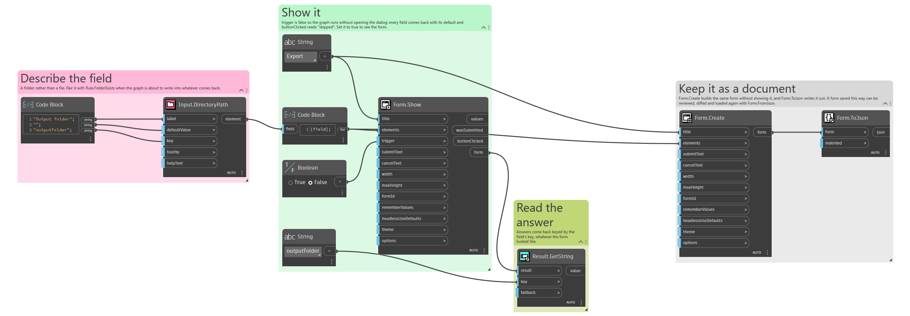

## In Depth

`Input.DirectoryPath(label, defaultValue: "", key: "", tooltip: "", helpText: "")`

A folder path with a Browse button, and a box that can also be typed or pasted into.

The answer is a single path string, without a trailing separator. The folder is not created and not checked — attach `Rule.FolderExists` with `Behavior.WithValidation` when the graph cannot cope with being pointed at somewhere that is not there, which is worth doing for an export destination typed by hand.

The inputs are:

- `label` (_string_) — Caption shown beside the field.
- `defaultValue` (_string_, defaults to `""`) — Path the field starts with.
- `key` (_string_, defaults to `""`) — Name of this answer in the results. Derived from the label when empty.
- `tooltip` (_string_, defaults to `""`) — Hover text.
- `helpText` (_string_, defaults to `""`) — A line of guidance shown under the field.

Returns `element` — The form element.

Search terms: `folder`, `directory`, `path`, `browse`.

___
## About the Input nodes

The fields a user answers.

Every input returns an element describing the control, not the control itself, and every one takes the same three trailing options: `key`, which names the answer in the results dictionary; `tooltip`; and `helpText`. Leave `key` empty and it is derived from the label — convenient for a quick form, but give real keys to any graph you intend to keep, because renaming a label would otherwise rename the answer.

Choice inputs take the values themselves, not their display names. Selecting an option hands back the original object — a Revit element, a family type, whatever was put in — so the answer is usable directly instead of needing a lookup back from a string.

___
## Example File

An example graph ships beside this page as `Interlude.Input.DirectoryPath.dyn`.

The form it builds:

