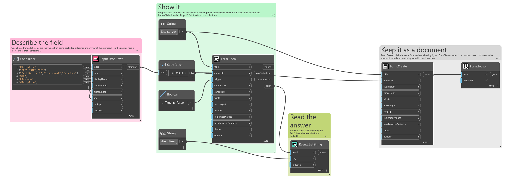
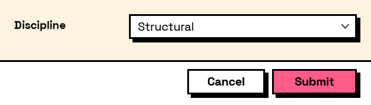

## In Depth

`Input.DropDown(label, items: null, displayNames: null, defaultValue: null, placeholder: "", key: "", tooltip: "", helpText: "")`

A drop-down list, for one choice out of many.

**The answer is the selected item itself, not its display name.** Feed in Revit elements, family types, whatever you have, and pass their names separately as `displayNames`; what comes back is the object you put in, ready to use. This is the difference that removes the lookup-by-name step — and the bug where two things share a name — from the middle of every graph that asks the user to pick something.

With no `defaultValue` and no `placeholder`, the first item starts selected, so the field is never empty. Give a `placeholder` instead when "nothing chosen yet" is a state you want to be able to tell apart, and pair it with `Behavior.Required`.

Above roughly a dozen options this beats `Input.RadioButtons` on space; below about four, radio buttons show every choice at once and save a click.

The inputs are:

- `label` (_string_) — Caption shown beside the field.
- `items` (_list of object_, defaults to `null`) — The values to choose between. Can be any objects.
- `displayNames` (_list of object_, defaults to `null`) — What to show for each item. Falls back to each item's own text.
- `defaultValue` (_object_, defaults to `null`) — Which item starts selected. Null selects the first.
- `placeholder` (_string_, defaults to `""`) — Grey prompt shown while nothing is selected.
- `key` (_string_, defaults to `""`) — Name of this answer in the results. Derived from the label when empty.
- `tooltip` (_string_, defaults to `""`) — Hover text.
- `helpText` (_string_, defaults to `""`) — A line of guidance shown under the field.

Returns `element` — The form element.

Search terms: `dropdown`, `combobox`, `select`, `choose`, `list`, `pick`.

___
## About the Input nodes

The fields a user answers.

Every input returns an element describing the control, not the control itself, and every one takes the same three trailing options: `key`, which names the answer in the results dictionary; `tooltip`; and `helpText`. Leave `key` empty and it is derived from the label — convenient for a quick form, but give real keys to any graph you intend to keep, because renaming a label would otherwise rename the answer.

Choice inputs take the values themselves, not their display names. Selecting an option hands back the original object — a Revit element, a family type, whatever was put in — so the answer is usable directly instead of needing a lookup back from a string.

___
## Example File

An example graph ships beside this page as `Interlude.Input.DropDown.dyn`.

The form it builds:

