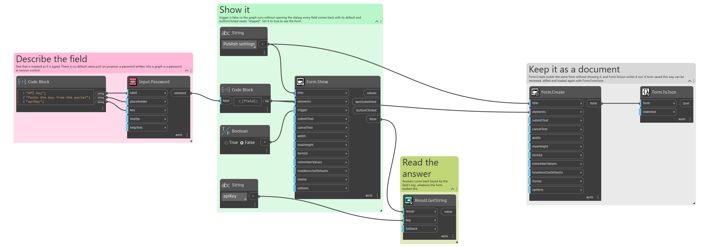
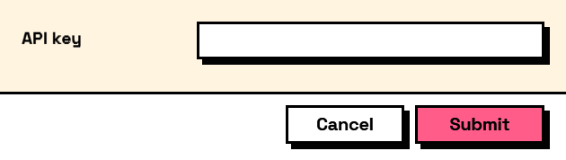

## In Depth

`Input.Password(label, placeholder: "", key: "", tooltip: "", helpText: "")`

A masked text field, showing dots instead of characters as they are typed.

Be clear about what this does and does not give you. **The answer comes back as plain text**, and it is held in memory with the form's other remembered answers for the rest of the Dynamo session — pass `rememberValues: false` to `Form.Show` if that matters. Nothing is written to disk, and nothing is encrypted. The masking stops somebody reading the screen over a shoulder, which is the whole of its job.

There is no default value on purpose: a password baked into a saved graph is a password shared with everybody the graph is sent to.

The inputs are:

- `label` (_string_) — Caption shown beside the field.
- `placeholder` (_string_, defaults to `""`) — Grey prompt shown while the field is empty.
- `key` (_string_, defaults to `""`) — Name of this answer in the results. Derived from the label when empty.
- `tooltip` (_string_, defaults to `""`) — Hover text.
- `helpText` (_string_, defaults to `""`) — A line of guidance shown under the field.

Returns `element` — The form element.

Search terms: `password`, `secret`, `masked`, `credential`.

___
## About the Input nodes

The fields a user answers.

Every input returns an element describing the control, not the control itself, and every one takes the same three trailing options: `key`, which names the answer in the results dictionary; `tooltip`; and `helpText`. Leave `key` empty and it is derived from the label — convenient for a quick form, but give real keys to any graph you intend to keep, because renaming a label would otherwise rename the answer.

Choice inputs take the values themselves, not their display names. Selecting an option hands back the original object — a Revit element, a family type, whatever was put in — so the answer is usable directly instead of needing a lookup back from a string.

___
## Example File

An example graph ships beside this page as `Interlude.Input.Password.dyn`.

The form it builds:

