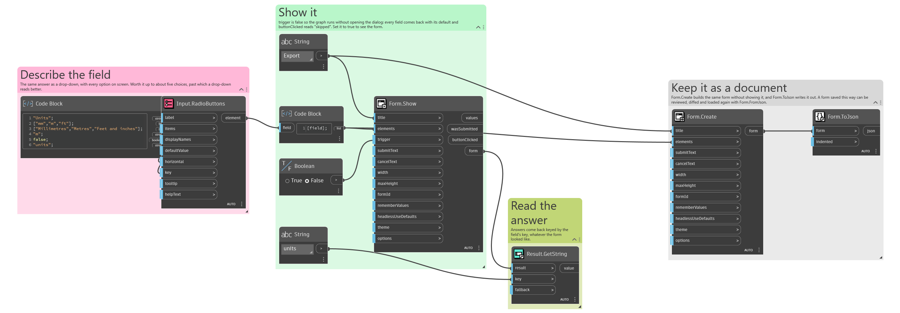
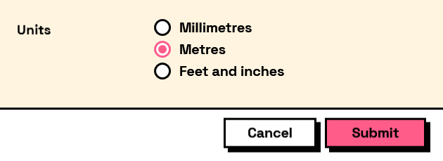

## In Depth

`Input.RadioButtons(label, items: null, displayNames: null, defaultValue: null, horizontal: false, key: "", tooltip: "", helpText: "")`

A set of mutually exclusive radio buttons, every choice visible at once.

The answer is the selected item itself, as with the other choice inputs. One is always selected — the first, unless `defaultValue` says otherwise — so there is no "nothing chosen" state to guard against.

Best for two to five options where the choice steers the rest of the form, because the user can read every alternative without opening anything. Past that it costs more vertical space than it is worth and `Input.DropDown` is the better shape.

The inputs are:

- `label` (_string_) — Caption shown beside the field.
- `items` (_list of object_, defaults to `null`) — The values to choose between. Can be any objects.
- `displayNames` (_list of object_, defaults to `null`) — What to show for each item. Falls back to each item's own text.
- `defaultValue` (_object_, defaults to `null`) — Which item starts selected. Null selects the first.
- `horizontal` (_boolean_, defaults to `false`) — Lay the buttons out in a row instead of a column.
- `key` (_string_, defaults to `""`) — Name of this answer in the results. Derived from the label when empty.
- `tooltip` (_string_, defaults to `""`) — Hover text.
- `helpText` (_string_, defaults to `""`) — A line of guidance shown under the field.

Returns `element` — The form element.

Search terms: `radio`, `option`, `choice`, `exclusive`.

___
## About the Input nodes

The fields a user answers.

Every input returns an element describing the control, not the control itself, and every one takes the same three trailing options: `key`, which names the answer in the results dictionary; `tooltip`; and `helpText`. Leave `key` empty and it is derived from the label — convenient for a quick form, but give real keys to any graph you intend to keep, because renaming a label would otherwise rename the answer.

Choice inputs take the values themselves, not their display names. Selecting an option hands back the original object — a Revit element, a family type, whatever was put in — so the answer is usable directly instead of needing a lookup back from a string.

___
## Example File

An example graph ships beside this page as `Interlude.Input.RadioButtons.dyn`.

The form it builds:

