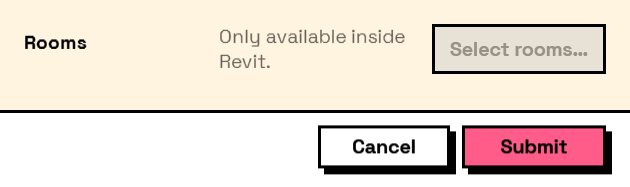

## In Depth

`Input.SelectElements(label, allowMultiple: true, buttonText: "", prompt: "", defaultValue: null, key: "", tooltip: "", helpText: "")`

A button that lets the user pick elements directly in the Revit model. The form minimises while they pick and comes back when they finish, with a summary of what they chose beside the button.

**The answer is the picked Revit element itself** — the same element every Dynamo Revit node works with — not an id or a name. A multi-select field stores a list of elements and a single-select field stores one, read with `Result.GetList` or straight out of `values`. Pressing Escape during the pick keeps whatever was selected before.

This only works with Dynamo running inside Revit, and Interlude still references no Revit assembly: the picking goes through the Revit API that is already loaded in the process. Anywhere else — Dynamo Sandbox, a saved form opened for review — the button is disabled with an explanation, and the rest of the form works normally.

Elements cannot ride along in a saved form file, for the same reason as drop-down options: they do not exist in another model. The field's configuration round-trips; its answer is live model data.

The inputs are:

- `label` (_string_) — Caption shown beside the field.
- `allowMultiple` (_boolean_, defaults to `true`) — Whether several elements can be picked. False ends the pick at the first click.
- `buttonText` (_string_, defaults to `""`) — Caption on the button. Empty gets "Select in model…".
- `prompt` (_string_, defaults to `""`) — Text shown in Revit's status bar while picking.
- `defaultValue` (_list of object_, defaults to `null`) — Elements the field starts with, from the graph.
- `key` (_string_, defaults to `""`) — Name of this answer in the results. Derived from the label when empty.
- `tooltip` (_string_, defaults to `""`) — Hover text.
- `helpText` (_string_, defaults to `""`) — A line of guidance shown under the field.

Returns `element` — The form element.

Search terms: `select`, `revit`, `pick`, `model`, `element`, `selection`.

___
## About the Input nodes

The fields a user answers.

Every input returns an element describing the control, not the control itself, and every one takes the same three trailing options: `key`, which names the answer in the results dictionary; `tooltip`; and `helpText`. Leave `key` empty and it is derived from the label — convenient for a quick form, but give real keys to any graph you intend to keep, because renaming a label would otherwise rename the answer.

Choice inputs take the values themselves, not their display names. Selecting an option hands back the original object — a Revit element, a family type, whatever was put in — so the answer is usable directly instead of needing a lookup back from a string.

___
## Example File

An example graph ships beside this page as `Interlude.Input.SelectElements.dyn`.

The form it builds:

