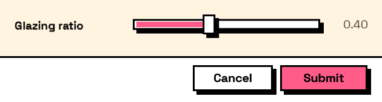

## In Depth

`Input.Slider(label, minimum: 0, maximum: 100, defaultValue: 0, step: 1, decimalPlaces: 2, key: "", tooltip: "", helpText: "")`

A number chosen by dragging along a track, with the value shown beside it.

Good when the range matters more than the exact figure — an opacity, a tolerance, a percentage — and the user is choosing by feel. When the exact figure is the point, and especially when it might be typed from a specification, `Input.Number` is kinder: a slider cannot be typed into.

The answer is a number. `step` snaps the track to increments; zero lets it move continuously.

The inputs are:

- `label` (_string_) — Caption shown beside the field.
- `minimum` (_number_, defaults to `0`) — Left end of the track.
- `maximum` (_number_, defaults to `100`) — Right end of the track.
- `defaultValue` (_number_, defaults to `0`) — Value the slider starts at.
- `step` (_number_, defaults to `1`) — Snap increment. Zero for continuous.
- `decimalPlaces` (_integer_, defaults to `2`) — Digits shown in the readout.
- `key` (_string_, defaults to `""`) — Name of this answer in the results. Derived from the label when empty.
- `tooltip` (_string_, defaults to `""`) — Hover text.
- `helpText` (_string_, defaults to `""`) — A line of guidance shown under the field.

Returns `element` — The form element.

Search terms: `slider`, `range`, `drag`, `number`.

___
## About the Input nodes

The fields a user answers.

Every input returns an element describing the control, not the control itself, and every one takes the same three trailing options: `key`, which names the answer in the results dictionary; `tooltip`; and `helpText`. Leave `key` empty and it is derived from the label — convenient for a quick form, but give real keys to any graph you intend to keep, because renaming a label would otherwise rename the answer.

Choice inputs take the values themselves, not their display names. Selecting an option hands back the original object — a Revit element, a family type, whatever was put in — so the answer is usable directly instead of needing a lookup back from a string.

___
## Example File

An example graph ships beside this page as `Interlude.Input.Slider.dyn`.

The form it builds:

