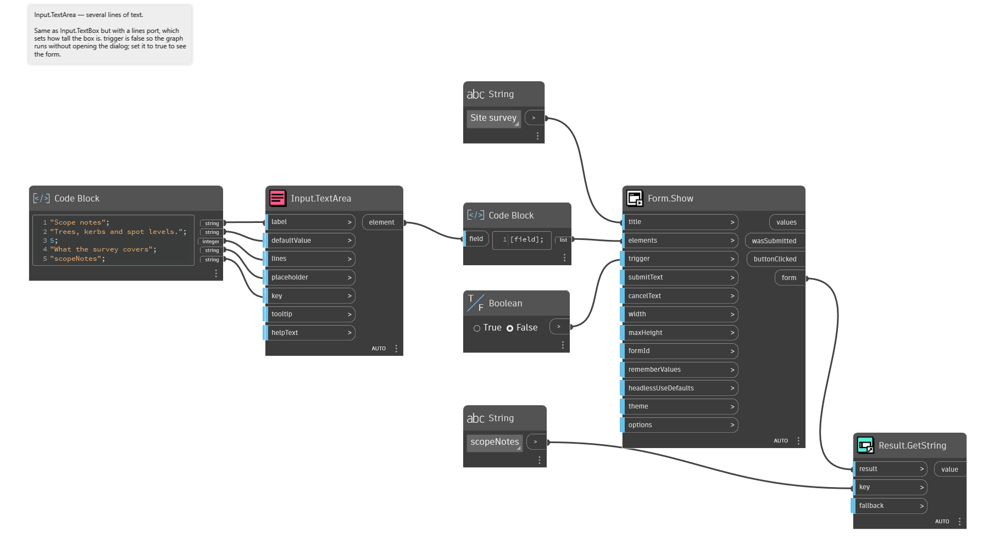
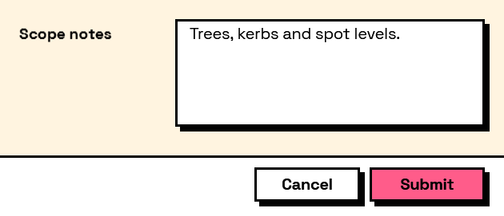

## In Depth

`Input.TextArea(label, defaultValue: "", lines: 4, placeholder: "", key: "", tooltip: "", helpText: "")`

A multi-line text field, for notes, justifications and descriptions.

The answer is a single string with line breaks inside it, not a list of lines. Split it downstream if you want the lines separately.

`lines` sets the height the field occupies, not a limit on what can be typed: the box scrolls once the text outgrows it.

The inputs are:

- `label` (_string_) — Caption shown beside the field.
- `defaultValue` (_string_, defaults to `""`) — Value the field starts with.
- `lines` (_integer_, defaults to `4`) — Visible height, in lines.
- `placeholder` (_string_, defaults to `""`) — Grey prompt shown while the field is empty.
- `key` (_string_, defaults to `""`) — Name of this answer in the results. Derived from the label when empty.
- `tooltip` (_string_, defaults to `""`) — Hover text.
- `helpText` (_string_, defaults to `""`) — A line of guidance shown under the field.

Returns `element` — The form element.

Search terms: `text`, `multiline`, `notes`, `paragraph`, `textarea`.

___
## About the Input nodes

The fields a user answers.

Every input returns an element describing the control, not the control itself, and every one takes the same three trailing options: `key`, which names the answer in the results dictionary; `tooltip`; and `helpText`. Leave `key` empty and it is derived from the label — convenient for a quick form, but give real keys to any graph you intend to keep, because renaming a label would otherwise rename the answer.

Choice inputs take the values themselves, not their display names. Selecting an option hands back the original object — a Revit element, a family type, whatever was put in — so the answer is usable directly instead of needing a lookup back from a string.

___
## Example File

An example graph ships beside this page as `Interlude.Input.TextArea.dyn`.

The form it builds:

