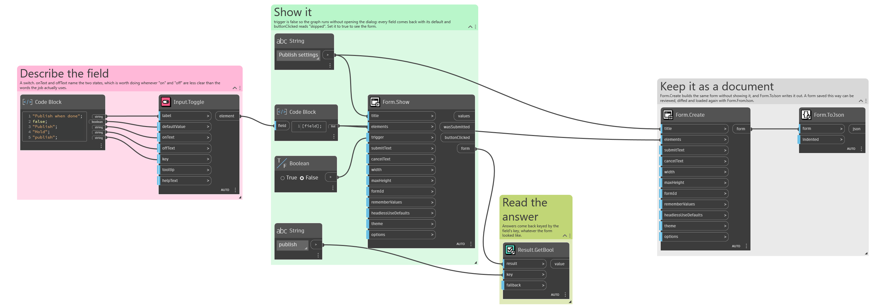
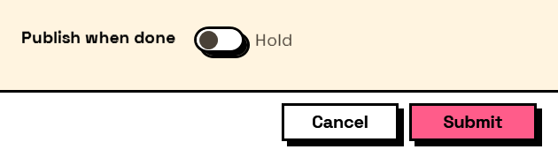

## In Depth

`Input.Toggle(label, defaultValue: false, onText: "On", offText: "Off", key: "", tooltip: "", helpText: "")`

An on/off switch. The answer is true or false, exactly as a tick box.

The difference from `Input.CheckBox` is what it says to the reader, not what it returns. A switch reads as a setting that takes effect — a mode being turned on — and it gets its own caption in the label column plus wording for each state. A tick box reads as a statement being agreed to. Pick by which sentence fits.

The inputs are:

- `label` (_string_) — Caption shown beside the switch.
- `defaultValue` (_boolean_, defaults to `false`) — Whether the switch starts on.
- `onText` (_string_, defaults to `"On"`) — Wording shown when the switch is on.
- `offText` (_string_, defaults to `"Off"`) — Wording shown when the switch is off.
- `key` (_string_, defaults to `""`) — Name of this answer in the results. Derived from the label when empty.
- `tooltip` (_string_, defaults to `""`) — Hover text.
- `helpText` (_string_, defaults to `""`) — A line of guidance shown under the field.

Returns `element` — The form element.

Search terms: `toggle`, `switch`, `boolean`, `on`, `off`.

___
## About the Input nodes

The fields a user answers.

Every input returns an element describing the control, not the control itself, and every one takes the same three trailing options: `key`, which names the answer in the results dictionary; `tooltip`; and `helpText`. Leave `key` empty and it is derived from the label — convenient for a quick form, but give real keys to any graph you intend to keep, because renaming a label would otherwise rename the answer.

Choice inputs take the values themselves, not their display names. Selecting an option hands back the original object — a Revit element, a family type, whatever was put in — so the answer is usable directly instead of needing a lookup back from a string.

___
## Example File

An example graph ships beside this page as `Interlude.Input.Toggle.dyn`.

The form it builds:

