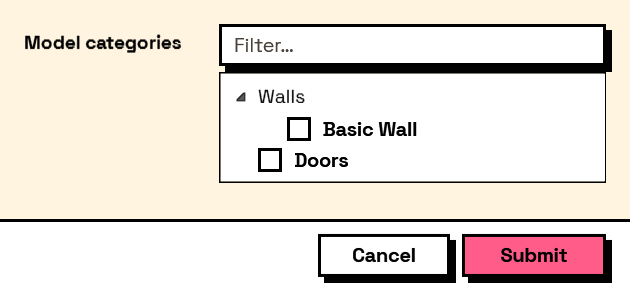

## In Depth

`Input.TreeSelect(label, nodes: null, allowMultiple: true, defaultValue: null, expandAll: false, key: "", tooltip: "", helpText: "")`

A hierarchy to pick from — levels and rooms, disciplines and sheets, folders and files.

The branches are built from `Input.TreeItem` nodes, nested by feeding items into a parent's `children` port. As with the flat choice inputs the answer is whatever each item's `value` was, and with `allowMultiple` it is a list of them.

A branch that only groups its children should be built with `selectable: false`, so the user cannot return a category where the graph expects a thing.

The inputs are:

- `label` (_string_) — Caption shown beside the field.
- `nodes` (_list of object_, defaults to `null`) — The root items of the tree.
- `allowMultiple` (_boolean_, defaults to `true`) — Whether several items can be chosen at once.
- `defaultValue` (_list of object_, defaults to `null`) — Which item or items start selected.
- `expandAll` (_boolean_, defaults to `false`) — Whether every branch starts open.
- `key` (_string_, defaults to `""`) — Name of this answer in the results. Derived from the label when empty.
- `tooltip` (_string_, defaults to `""`) — Hover text.
- `helpText` (_string_, defaults to `""`) — A line of guidance shown under the field.

Returns `element` — The form element.

Search terms: `tree`, `hierarchy`, `nested`, `select`.

___
## About the Input nodes

The fields a user answers.

Every input returns an element describing the control, not the control itself, and every one takes the same three trailing options: `key`, which names the answer in the results dictionary; `tooltip`; and `helpText`. Leave `key` empty and it is derived from the label — convenient for a quick form, but give real keys to any graph you intend to keep, because renaming a label would otherwise rename the answer.

Choice inputs take the values themselves, not their display names. Selecting an option hands back the original object — a Revit element, a family type, whatever was put in — so the answer is usable directly instead of needing a lookup back from a string.

___
## Example File

An example graph ships beside this page as `Interlude.Input.TreeSelect.dyn`.

The form it builds:

