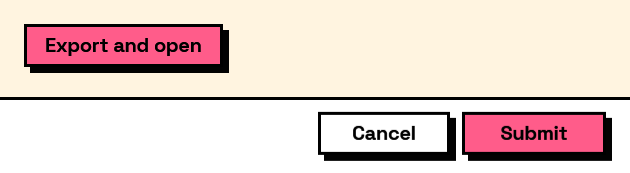

## In Depth

`Layout.Button(text, tag: "", primary: false)`

A button that closes the form and reports its tag on `buttonClicked`, which is how one form offers several outcomes such as "Place" and "Place and continue".

A closing button counts as submitting: the answers come back filled in and `wasSubmitted` is true, so branch on `Result.ButtonClicked` to tell which way the user went. Give every button a distinct `tag`; the caption is for the reader and can be reworded without breaking the graph, the tag is what the graph tests.

Validation still applies. A form with an invalid field will not close on any of them.

The inputs are:

- `text` (_string_) — The button's caption.
- `tag` (_string_, defaults to `""`) — Reported as buttonClicked. Falls back to the caption.
- `primary` (_boolean_, defaults to `false`) — Draw in the accent colour, as the main action.

Returns `element` — The form element.

Search terms: `button`, `action`, `submit`, `command`.

___
## About the Layout nodes

Arranging and decorating a form: sections, rows, grids, tabs, and the elements that show something rather than ask something.

Every container takes a list of elements. None of them has a single-element overload, on purpose: with both available, a graph that passes one element to a list port gets replication instead of a container, and produces N containers of one child each rather than one container of N. Pass a list, even a list of one.

___
## Example File

An example graph ships beside this page as `Interlude.Layout.Button.dyn`.

The form it builds:

