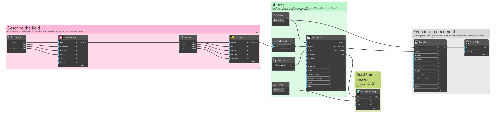
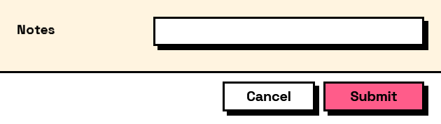

## In Depth

`Layout.Cell(element, row: 0, column: 0, rowSpan: 1, columnSpan: 1)`

Places an element in a specific cell of a `Layout.Grid`, optionally spanning several.

Only needed when the automatic left-to-right, top-to-bottom filling is not what you want — to leave a cell empty, or to let one element run across the full width above the rest. Mixing placed and unplaced elements in one grid works, but the unplaced ones keep flowing into the next free cell and it gets hard to predict; place all of them or none.

Rows and columns are numbered from zero.

The inputs are:

- `element` (_FormElement_) — The element to place.
- `row` (_integer_, defaults to `0`) — Zero-based row.
- `column` (_integer_, defaults to `0`) — Zero-based column.
- `rowSpan` (_integer_, defaults to `1`) — How many rows to cover.
- `columnSpan` (_integer_, defaults to `1`) — How many columns to cover.

Returns `element` — The placed element.

Search terms: `cell`, `grid`, `place`, `span`, `position`.

___
## About the Layout nodes

Arranging and decorating a form: sections, rows, grids, tabs, and the elements that show something rather than ask something.

Every container takes a list of elements. None of them has a single-element overload, on purpose: with both available, a graph that passes one element to a list port gets replication instead of a container, and produces N containers of one child each rather than one container of N. Pass a list, even a list of one.

___
## Example File

An example graph ships beside this page as `Interlude.Layout.Cell.dyn`.

The form it builds:

