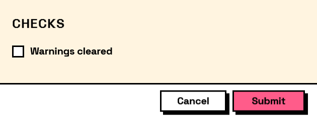

## In Depth

`Layout.Column(elements, spacing: -1)`

Elements stacked top to bottom.

This is what a form already does with the elements handed to `Form.Show`, so a column at the top level changes nothing. It earns its place *inside* something else: one pane of a `Layout.Split`, one cell of a `Layout.Grid`, one side of a `Layout.Row` — anywhere a single slot has to hold several elements.

The inputs are:

- `elements` (_list of FormElement_) — What goes inside.
- `spacing` (_number_, defaults to `-1`) — Gap between elements. Negative uses the theme's spacing.

Returns `element` — The form element.

Search terms: `column`, `vertical`, `vstack`, `stack`.

___
## About the Layout nodes

Arranging and decorating a form: sections, rows, grids, tabs, and the elements that show something rather than ask something.

Every container takes a list of elements. None of them has a single-element overload, on purpose: with both available, a graph that passes one element to a list port gets replication instead of a container, and produces N containers of one child each rather than one container of N. Pass a list, even a list of one.

___
## Example File

An example graph ships beside this page as `Interlude.Layout.Column.dyn`.

The form it builds:

