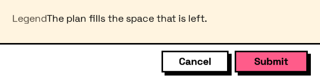

## In Depth

`Layout.Dock(elements, lastChildFills: true)`

Elements docked to the edges of the available space. Use `Layout.Docked` to choose each element's edge; the last one fills what is left.

The inputs are:

- `elements` (_list of FormElement_) — What goes inside.
- `lastChildFills` (_boolean_, defaults to `true`) — Let the final element take the remaining space.

Returns `element` — The form element.

Search terms: `dock`, `dockpanel`, `edges`, `anchor`.

___
## About the Layout nodes

Arranging and decorating a form: sections, rows, grids, tabs, and the elements that show something rather than ask something.

Every container takes a list of elements. None of them has a single-element overload, on purpose: with both available, a graph that passes one element to a list port gets replication instead of a container, and produces N containers of one child each rather than one container of N. Pass a list, even a list of one.

___
## Example File

An example graph ships beside this page as `Interlude.Layout.Dock.dyn`.

The form it builds:

