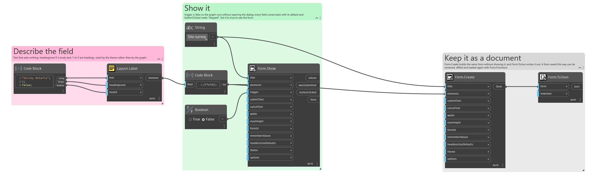
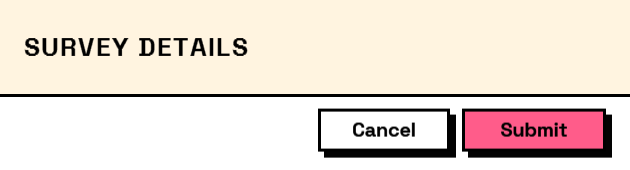

## In Depth

`Layout.Label(text, headingLevel: 0, muted: false)`

A run of static text: an instruction, a note, a heading.

Shows something rather than asking something, so it contributes nothing to the answers and needs no key.

`headingLevel` above zero makes it a heading — 1 is largest, 4 smallest — and headings take the theme's capitals and letter-spacing where body text never does. `isMuted` greys it for an aside.

For a sentence explaining one field, `Behavior.WithHelp` puts it under that field where it belongs, instead of leaving the reader to work out which one it refers to.

The inputs are:

- `text` (_string_) — What to show.
- `headingLevel` (_integer_, defaults to `0`) — 1 to 4 renders as a heading; 0 is body text.
- `muted` (_boolean_, defaults to `false`) — Draw in the secondary colour, for captions and asides.

Returns `element` — The form element.

Search terms: `label`, `text`, `caption`, `heading`, `title`.

___
## About the Layout nodes

Arranging and decorating a form: sections, rows, grids, tabs, and the elements that show something rather than ask something.

Every container takes a list of elements. None of them has a single-element overload, on purpose: with both available, a graph that passes one element to a list port gets replication instead of a container, and produces N containers of one child each rather than one container of N. Pass a list, even a list of one.

___
## Example File

An example graph ships beside this page as `Interlude.Layout.Label.dyn`.

The form it builds:

