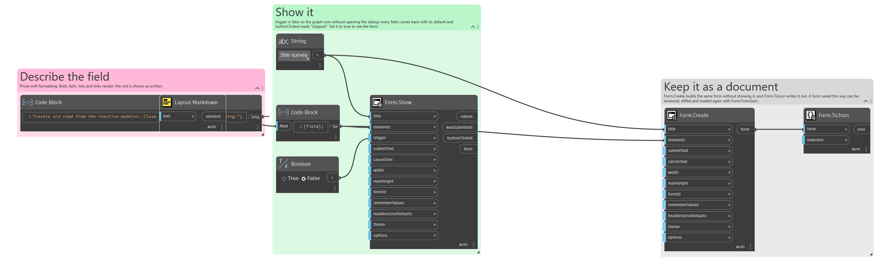
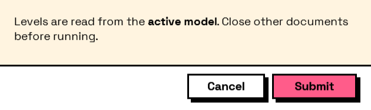

## In Depth

`Layout.Markdown(text)`

A block of Markdown, for anything longer than a sentence.

Supports headings, bold, italic, inline code, links, bullet and numbered lists, and horizontal rules. Not a full Markdown implementation — no tables, images or block quotes — because the alternative was a dependency, and the package ships no code it did not write. Anything unrecognised is shown as the plain text it was written as, so an unsupported construct degrades into something readable rather than into markup on screen.

This is where instructions belong when they need structure. For a single line, `Layout.Label` is less machinery.

The inputs are:

- `text` (_string_) — The Markdown source.

Returns `element` — The form element.

Search terms: `markdown`, `rich text`, `formatted`, `documentation`.

___
## About the Layout nodes

Arranging and decorating a form: sections, rows, grids, tabs, and the elements that show something rather than ask something.

Every container takes a list of elements. None of them has a single-element overload, on purpose: with both available, a graph that passes one element to a list port gets replication instead of a container, and produces N containers of one child each rather than one container of N. Pass a list, even a list of one.

___
## Example File

An example graph ships beside this page as `Interlude.Layout.Markdown.dyn`.

The form it builds:

