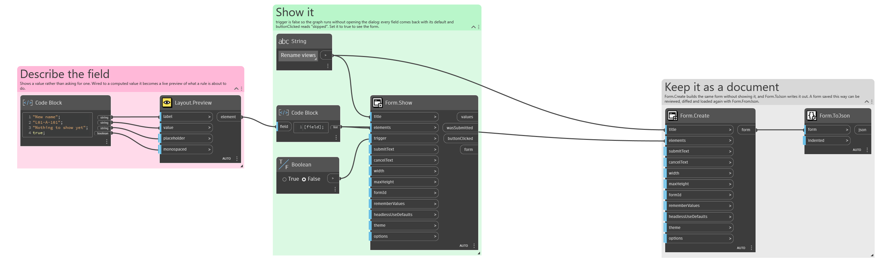
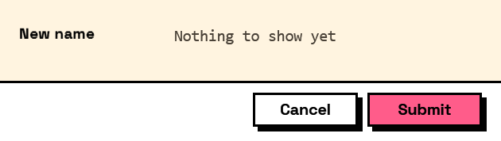

## In Depth

`Layout.Preview(label, value, placeholder: "", monospaced: false)`

A value the form works out and shows back, live, as the fields it reads are edited.

`value` is usually a template — `"{prefix}{sample_name}{suffix}"` — where each name in braces is a field's key. It also accepts any `Compute` node, for a preview that has to choose between two forms:

Layout.Preview("New name", Compute.If(Condition.IsChecked("add_number"), Compute.Format("{prefix}{sample_name} {start_number:000}"), Compute.Format("{prefix}{sample_name}")))

A placeholder may carry a format specifier after a colon: `{start_number:000}` pads to three digits, `{total:F2}` fixes two decimals, `{due:yyyy-MM-dd}` writes a date the way a file name wants it.

A preview answers nothing. It has no key, never appears in a form's results, and is never validated — which is what separates it from a read-only field carrying a computed value. Reach for that instead when you need the value back out of the form.

Everything a preview shows must already be on the form. Interlude knows nothing about the items a graph is about to work on, so a form renaming fifty views previews one sample name the author supplies — most naturally as the default value of a field the user can edit, which doubles as a way to try the rule against an awkward name.

The inputs are:

- `label` (_string_) — The caption, shown in the same column as the fields' labels.
- `value` (_object_) — A template string, or a computation from the `Compute` nodes.
- `placeholder` (_string_, defaults to `""`) — Shown while the value is empty.
- `monospaced` (_boolean_, defaults to `false`) — Render in a fixed-width face, for names, codes and paths.

Returns `element` — The form element.

Search terms: `preview`, `live`, `derived`, `computed`, `summary`, `result`, `format`, `template`.

___
## About the Layout nodes

Arranging and decorating a form: sections, rows, grids, tabs, and the elements that show something rather than ask something.

Every container takes a list of elements. None of them has a single-element overload, on purpose: with both available, a graph that passes one element to a list port gets replication instead of a container, and produces N containers of one child each rather than one container of N. Pass a list, even a list of one.

___
## Example File

An example graph ships beside this page as `Interlude.Layout.Preview.dyn`.

The form it builds:

