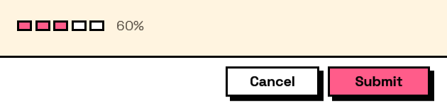

## In Depth

`Layout.Progress(value: 0, maximum: 100, indeterminate: false, segments: 0)`

A progress bar showing a **fixed** value.

Read that twice before using it. Nothing in the form moves this bar: a form runs while the graph waits, so there is no work going on behind it to report. It is for showing a figure that was already worked out — twelve of twenty sheets issued, sixty per cent of the budget spent — and for that it is a clearer picture than the number alone.

It is not a way to show a long operation running. That happens after the form closes, when there is no form left to draw in.

`segments` above zero draws discrete cells instead of a continuous fill, and cells fill by rounding — five of seven days is five whole cells, because a part-filled cell invites the reader to wonder what a partial day was. Use it for counting, and the continuous bar for measuring.

The inputs are:

- `value` (_number_, defaults to `0`) — How far along, between 0 and the maximum.
- `maximum` (_number_, defaults to `100`) — The value that counts as complete.
- `indeterminate` (_boolean_, defaults to `false`) — Show a looping animation instead of a fixed amount.
- `segments` (_integer_, defaults to `0`) — Draw the bar as this many discrete cells rather than one continuous fill. Zero is continuous. Segments are for counting rather than measuring: "five of seven days" reads off a segmented bar at a glance, where a continuous bar at 71% does not.

Returns `element` — The form element.

Search terms: `progress`, `bar`, `percent`, `loading`, `segments`, `steps`.

___
## About the Layout nodes

Arranging and decorating a form: sections, rows, grids, tabs, and the elements that show something rather than ask something.

Every container takes a list of elements. None of them has a single-element overload, on purpose: with both available, a graph that passes one element to a list port gets replication instead of a container, and produces N containers of one child each rather than one container of N. Pass a list, even a list of one.

___
## Example File

An example graph ships beside this page as `Interlude.Layout.Progress.dyn`.

The form it builds:

