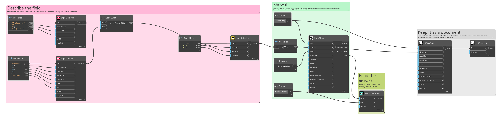
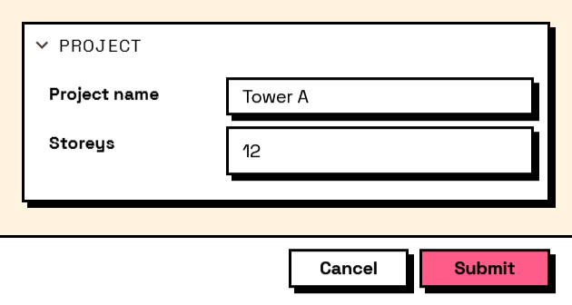

## In Depth

`Layout.Section(header, elements, collapsible: false, expanded: true)`

A titled section: a heading with a bordered panel of elements under it.

The first reach for structure in a long form. Grouping six fields under "Naming" and four under "Output" turns a wall of inputs into two things to read, and costs one node.

With `collapsible` the user can fold it away. A folded section still submits every field inside it — folding hides, it does not exclude. To actually leave fields out of the answers, attach `Behavior.VisibleIf`: hidden fields are never validated and never block submission.

The inputs are:

- `header` (_string_) — The section's title.
- `elements` (_list of FormElement_) — What goes inside.
- `collapsible` (_boolean_, defaults to `false`) — Let the user fold the section away.
- `expanded` (_boolean_, defaults to `true`) — Whether a collapsible section starts open.

Returns `element` — The form element.

Search terms: `section`, `group`, `box`, `fieldset`, `collapsible`.

___
## About the Layout nodes

Arranging and decorating a form: sections, rows, grids, tabs, and the elements that show something rather than ask something.

Every container takes a list of elements. None of them has a single-element overload, on purpose: with both available, a graph that passes one element to a list port gets replication instead of a container, and produces N containers of one child each rather than one container of N. Pass a list, even a list of one.

___
## Example File

An example graph ships beside this page as `Interlude.Layout.Section.dyn`.

The form it builds:

