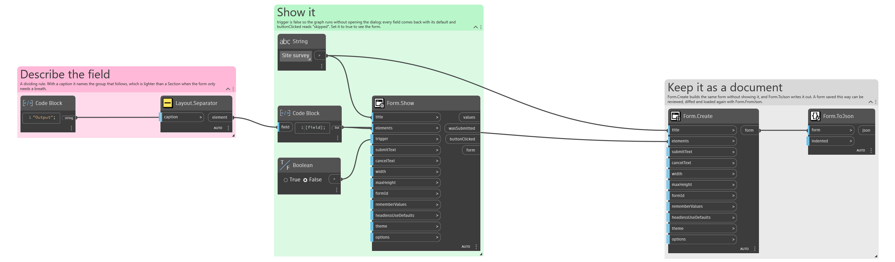
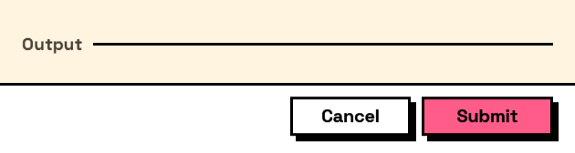

## In Depth

`Layout.Separator(caption: "")`

A dividing line, optionally with a caption sitting on it.

The lightest way to group: it separates what is above from what is below without the border, heading and indentation a `Layout.Section` brings. A captioned separator gives the group a name for the price of one line.

The inputs are:

- `caption` (_string_, defaults to `""`) — Optional text drawn on the line.

Returns `element` — The form element.

Search terms: `separator`, `divider`, `rule`, `line`, `hr`.

___
## About the Layout nodes

Arranging and decorating a form: sections, rows, grids, tabs, and the elements that show something rather than ask something.

Every container takes a list of elements. None of them has a single-element overload, on purpose: with both available, a graph that passes one element to a list port gets replication instead of a container, and produces N containers of one child each rather than one container of N. Pass a list, even a list of one.

___
## Example File

An example graph ships beside this page as `Interlude.Layout.Separator.dyn`.

The form it builds:

