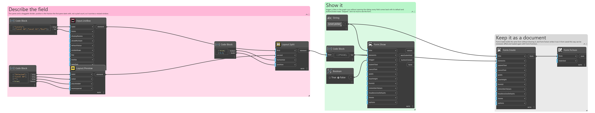
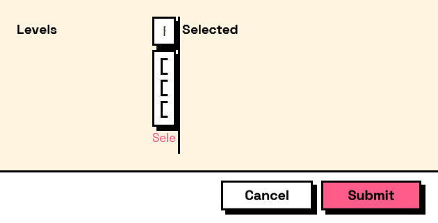

## In Depth

`Layout.Split(first, second, horizontal: true, position: 0.5)`

Two panes separated by a splitter the user can drag.

For the case where the right balance depends on the data rather than on the designer — a list of things beside the settings for the selected one, where one project has four items and the next has four hundred.

The split position is where it starts, not where it stays: dragging it is the point, and the position is not remembered between runs.

The inputs are:

- `first` (_FormElement_) — The left or top pane.
- `second` (_FormElement_) — The right or bottom pane.
- `horizontal` (_boolean_, defaults to `true`) — Split side by side rather than one above the other.
- `position` (_number_, defaults to `0.5`) — Share of the space given to the first pane, from 0 to 1.

Returns `element` — The form element.

Search terms: `split`, `splitter`, `panes`, `resize`.

___
## About the Layout nodes

Arranging and decorating a form: sections, rows, grids, tabs, and the elements that show something rather than ask something.

Every container takes a list of elements. None of them has a single-element overload, on purpose: with both available, a graph that passes one element to a list port gets replication instead of a container, and produces N containers of one child each rather than one container of N. Pass a list, even a list of one.

___
## Example File

An example graph ships beside this page as `Interlude.Layout.Split.dyn`.

The form it builds:

