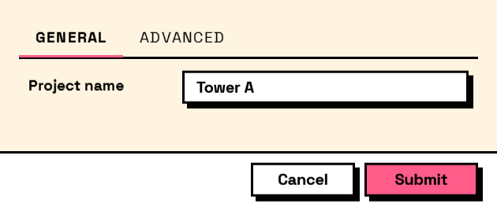

## In Depth

`Layout.Tabs(pages, selectedIndex: 0)`

A tab strip, for a form with more in it than fits on one screen.

Its children should be `Layout.TabPage` elements; anything else lands on an unnamed page. Every field on every page is part of the same form and comes back in the same answers — tabs divide the screen, not the results.

Worth knowing before choosing tabs over sections: a field failing validation on a page the user is not looking at will block submission, and the error is on the other page. Keep fields that validate against each other on the same tab.

The inputs are:

- `pages` (_list of FormElement_) — The pages, built with Layout.TabPage.
- `selectedIndex` (_integer_, defaults to `0`) — Which page is shown first.

Returns `element` — The form element.

Search terms: `tabs`, `tabcontrol`, `pages`, `notebook`.

___
## About the Layout nodes

Arranging and decorating a form: sections, rows, grids, tabs, and the elements that show something rather than ask something.

Every container takes a list of elements. None of them has a single-element overload, on purpose: with both available, a graph that passes one element to a list port gets replication instead of a container, and produces N containers of one child each rather than one container of N. Pass a list, even a list of one.

___
## Example File

An example graph ships beside this page as `Interlude.Layout.Tabs.dyn`.

The form it builds:

