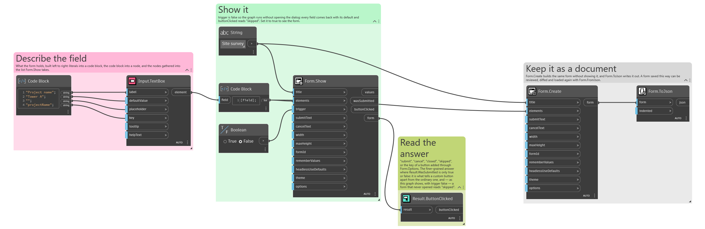

## In Depth

`Result.ButtonClicked(result)`

Which button ended the form: "submit", "cancel", "closed", "skipped", or a custom button's tag.

How one form offers several outcomes. Add buttons with `Layout.Button`, give each a distinct tag, and branch on what comes back here — "Place", "Place and continue" and "Preview only" from a single dialog.

The four built-in values are worth telling apart: "closed" is the window's X, and "skipped" means the dialog never appeared because `trigger` was false and the last answers were returned instead.

The inputs are:

- `result` (_object_) — The form output of Form.Show.

Returns `buttonClicked` — The button's name.

Search terms: `button`, `clicked`, `action`, `which`.

___
## About the Result nodes

Reading a form's answers.

Every node here accepts either the `values` dictionary or the `form` output of `Form.Show`, so it does not matter which one is to hand. They exist so a graph can say what it expects — a number, a date, a colour — rather than pulling an object out of a dictionary and hoping. Each one takes a fallback used when the field is missing or empty, which is what keeps a downstream node from receiving a null it was not expecting.

___
## Example File

An example graph ships beside this page as `Interlude.Result.ButtonClicked.dyn`.

The form it builds:

