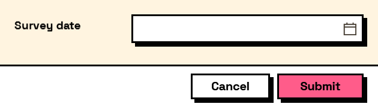

## In Depth

`Result.GetDate(result, key, fallback: null)`

A field's answer as a date.

A date field left empty answers with nothing at all — it is the one input whose answer can genuinely be absent — so the fallback here earns its keep more than most.

Dates stored as text are read back in a culture-independent form, which is what lets a form written in one region load correctly in another. Only what the user *sees* follows the machine's own format.

The inputs are:

- `result` (_object_) — The values dictionary or the form output of Form.Show.
- `key` (_string_) — The field to read.
- `fallback` (_object_, defaults to `null`) — Returned when the field is missing or empty.

Returns `value` — The answer as a date.

Search terms: `date`, `datetime`, `time`, `when`, `get`, `read`.

___
## About the Result nodes

Reading a form's answers.

Every node here accepts either the `values` dictionary or the `form` output of `Form.Show`, so it does not matter which one is to hand. They exist so a graph can say what it expects — a number, a date, a colour — rather than pulling an object out of a dictionary and hoping. Each one takes a fallback used when the field is missing or empty, which is what keeps a downstream node from receiving a null it was not expecting.

___
## Example File

An example graph ships beside this page as `Interlude.Result.GetDate.dyn`.

The form it builds:

