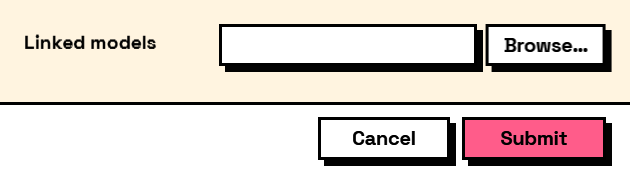

## In Depth

`Result.GetFilePaths(result, key)`

A file or folder field's answer as a list of paths.

**Always a list**, whether the field allowed several files or exactly one, so the graph downstream is written the same way either time and does not break when the field is later changed to accept more.

The inputs are:

- `result` (_object_) — The values dictionary or the form output of Form.Show.
- `key` (_string_) — The field to read.

Returns `paths` — The paths.

Search terms: `files`, `paths`, `filepaths`, `folder`, `get`.

___
## About the Result nodes

Reading a form's answers.

Every node here accepts either the `values` dictionary or the `form` output of `Form.Show`, so it does not matter which one is to hand. They exist so a graph can say what it expects — a number, a date, a colour — rather than pulling an object out of a dictionary and hoping. Each one takes a fallback used when the field is missing or empty, which is what keeps a downstream node from receiving a null it was not expecting.

___
## Example File

An example graph ships beside this page as `Interlude.Result.GetFilePaths.dyn`.

The form it builds:

