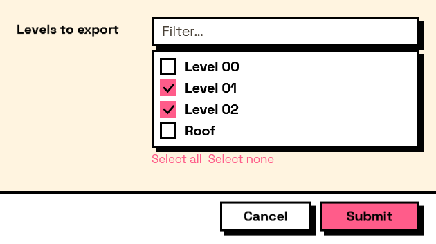

## In Depth

`Result.GetList(result, key)`

A field's answer as a list. A single answer comes back as a one-item list, so a downstream node never has to care whether the field allowed several.

The inputs are:

- `result` (_object_) — The values dictionary or the form output of Form.Show.
- `key` (_string_) — The field to read.

Returns `values` — The answers as a list.

Search terms: `list`, `multiple`, `selection`, `items`, `get`.

___
## About the Result nodes

Reading a form's answers.

Every node here accepts either the `values` dictionary or the `form` output of `Form.Show`, so it does not matter which one is to hand. They exist so a graph can say what it expects — a number, a date, a colour — rather than pulling an object out of a dictionary and hoping. Each one takes a fallback used when the field is missing or empty, which is what keeps a downstream node from receiving a null it was not expecting.

___
## Example File

An example graph ships beside this page as `Interlude.Result.GetList.dyn`.

The form it builds:

