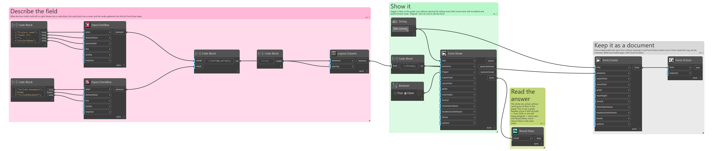
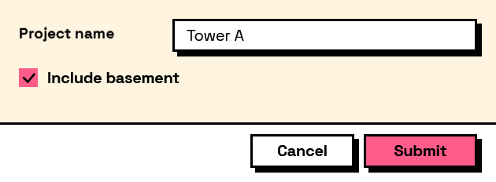

## In Depth

`Result.Keys(result)`

Every field name in the answers.

What a form actually produced, which is the quickest way to find out why `Result.GetString` is handing back its fallback: the key you asked for is not in this list, usually because it was derived from a label that has since been reworded.

Pairs with `Result.Values`, which returns the answers in the same order.

The inputs are:

- `result` (_object_) — The values dictionary or the form output of Form.Show.

Returns `keys` — The field names.

Search terms: `keys`, `fields`, `names`, `list`.

___
## About the Result nodes

Reading a form's answers.

Every node here accepts either the `values` dictionary or the `form` output of `Form.Show`, so it does not matter which one is to hand. They exist so a graph can say what it expects — a number, a date, a colour — rather than pulling an object out of a dictionary and hoping. Each one takes a fallback used when the field is missing or empty, which is what keeps a downstream node from receiving a null it was not expecting.

___
## Example File

An example graph ships beside this page as `Interlude.Result.Keys.dyn`.

The form it builds:

