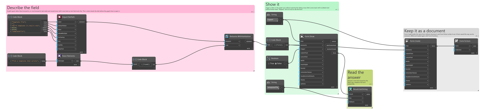
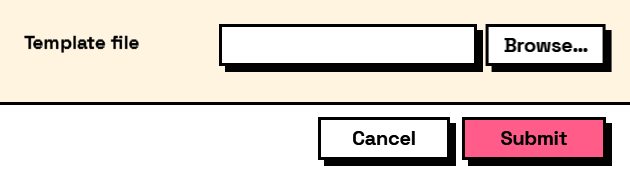

## In Depth

`Rule.FileExists(message: "")`

The path the field holds must exist on disk.

Catches the mistyped or moved path while the user is still looking at the form, rather than three nodes downstream when the graph fails to open it.

It is checked from the machine running the graph, as the user running it — so a network path they cannot reach fails here even though it exists. That is the right answer: the graph could not have opened it either.

Do not attach this to a `forSaving` file field. Naming a file that does not exist yet is the entire point of a save dialog.

The inputs are:

- `message` (_string_, defaults to `""`) — Wording shown when it does not.

Returns `rule` — The rule.

Search terms: `file exists`, `path`, `disk`, `exists`.

___
## About the Rule nodes

Checks applied to a field's answer, for use with `Behavior.WithValidation`.

Rules run as the user types and block submission while any of them fails. A rule on a field the user cannot see is never applied — a hidden field can never stop a form being submitted, which would otherwise mean an error with no control to fix it.

Except for `Rule.Required`, every rule passes on an empty field. Emptiness is `Behavior.Required`'s business, so an optional field with a range on it stays optional.

___
## Example File

An example graph ships beside this page as `Interlude.Rule.FileExists.dyn`.

The form it builds:

