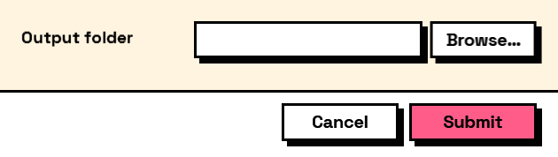

## In Depth

`Rule.FolderExists(message: "")`

The folder the field holds must exist on disk.

Worth attaching to any export destination, especially one that can be typed rather than browsed to: a folder that is not there is the most common reason an otherwise correct export run produces nothing.

It checks, and does not create. Making the folder is the graph's job, and if that is what you intend then this rule is the wrong one.

The inputs are:

- `message` (_string_, defaults to `""`) — Wording shown when it does not.

Returns `rule` — The rule.

Search terms: `folder exists`, `directory`, `path`, `disk`, `exists`.

___
## About the Rule nodes

Checks applied to a field's answer, for use with `Behavior.WithValidation`.

Rules run as the user types and block submission while any of them fails. A rule on a field the user cannot see is never applied — a hidden field can never stop a form being submitted, which would otherwise mean an error with no control to fix it.

Except for `Rule.Required`, every rule passes on an empty field. Emptiness is `Behavior.Required`'s business, so an optional field with a range on it stays optional.

___
## Example File

An example graph ships beside this page as `Interlude.Rule.FolderExists.dyn`.

The form it builds:

