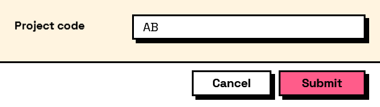

## In Depth

`Rule.Length(minimum: null, maximum: null, message: "")`

The field's text length, or the number of items selected, must fall between the bounds.

The inputs are:

- `minimum` (_object_, defaults to `null`) — Fewest acceptable characters or items.
- `maximum` (_object_, defaults to `null`) — Most acceptable characters or items.
- `message` (_string_, defaults to `""`) — Wording shown when it does not.

Returns `rule` — The rule.

Search terms: `length`, `characters`, `count`, `size`, `items`.

___
## About the Rule nodes

Checks applied to a field's answer, for use with `Behavior.WithValidation`.

Rules run as the user types and block submission while any of them fails. A rule on a field the user cannot see is never applied — a hidden field can never stop a form being submitted, which would otherwise mean an error with no control to fix it.

Except for `Rule.Required`, every rule passes on an empty field. Emptiness is `Behavior.Required`'s business, so an optional field with a range on it stays optional.

___
## Example File

An example graph ships beside this page as `Interlude.Rule.Length.dyn`.

The form it builds:

